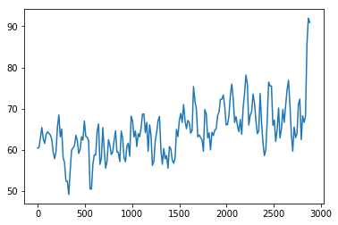

On ESPN if you watch the gamecast of a game they give an updated win percentage as the game progresses. We are going to produce a similar prediction, calculating win percentage for a home team given point differential, quarter, and time left in the game.

We are calculating:  
    p(home_win|[time_left, point_diff]=[t,p])

We'll do the simplest frequentist prediction by counting up the number of games where [t,p] occurs and then counting up the number of games where that [t,p] occurs and the home team won. This project is mostly to practice working with data both in python, but also later in SQL because I will perform this same analysis with an NCAA BigQuery database.


```python
# This Python 3 environment comes with many helpful analytics libraries installed
# It is defined by the kaggle/python docker image: https://github.com/kaggle/docker-python
# For example, here's several helpful packages to load in

import numpy as np # linear algebra
import pandas as pd # data processing, CSV file I/O (e.g. pd.read_csv)
from matplotlib import pyplot as plt
%matplotlib inline

# Input data files are available in the "../input/" directory.
# For example, running this (by clicking run or pressing Shift+Enter) will list all files under the input directory

import os
for dirname, _, filenames in os.walk('/kaggle/input'):
    for filename in filenames:
        print(os.path.join(dirname, filename))

# Any results you write to the current directory are saved as output.
```

    /kaggle/input/nba-playbyplay-data-20182019/NBA-PBP-2018-2019.csv


```python
df = pd.read_csv('/kaggle/input/nba-playbyplay-data-20182019/NBA-PBP-2018-2019.csv')
df.head()
```


<div>
<style scoped>
    .dataframe tbody tr th:only-of-type {
        vertical-align: middle;
    }

    .dataframe tbody tr th {
        vertical-align: top;
    }

    .dataframe thead th {
        text-align: right;
    }
</style>
<table border="1" class="dataframe">
  <thead>
    <tr style="text-align: right;">
      <th></th>
      <th>URL</th>
      <th>GameType</th>
      <th>Location</th>
      <th>Date</th>
      <th>Time</th>
      <th>WinningTeam</th>
      <th>Quarter</th>
      <th>SecLeft</th>
      <th>AwayTeam</th>
      <th>AwayPlay</th>
      <th>...</th>
      <th>FreeThrowNum</th>
      <th>EnterGame</th>
      <th>LeaveGame</th>
      <th>TurnoverPlayer</th>
      <th>TurnoverType</th>
      <th>TurnoverCause</th>
      <th>TurnoverCauser</th>
      <th>JumpballAwayPlayer</th>
      <th>JumpballHomePlayer</th>
      <th>JumpballPoss</th>
    </tr>
  </thead>
  <tbody>
    <tr>
      <th>0</th>
      <td>/boxscores/201810160BOS.html</td>
      <td>regular</td>
      <td>TD Garden Boston Massachusetts</td>
      <td>October 16 2018</td>
      <td>8:00 PM</td>
      <td>BOS</td>
      <td>1</td>
      <td>720</td>
      <td>PHI</td>
      <td>Jump ball: J. Embiid vs. A. Horford (B. Simmon...</td>
      <td>...</td>
      <td>NaN</td>
      <td>NaN</td>
      <td>NaN</td>
      <td>NaN</td>
      <td>NaN</td>
      <td>NaN</td>
      <td>NaN</td>
      <td>J. Embiid - PHI</td>
      <td>A. Horford - BOS</td>
      <td>B. Simmons</td>
    </tr>
    <tr>
      <th>1</th>
      <td>/boxscores/201810160BOS.html</td>
      <td>regular</td>
      <td>TD Garden Boston Massachusetts</td>
      <td>October 16 2018</td>
      <td>8:00 PM</td>
      <td>BOS</td>
      <td>1</td>
      <td>700</td>
      <td>PHI</td>
      <td>R. Covington misses 3-pt jump shot from 27 ft</td>
      <td>...</td>
      <td>NaN</td>
      <td>NaN</td>
      <td>NaN</td>
      <td>NaN</td>
      <td>NaN</td>
      <td>NaN</td>
      <td>NaN</td>
      <td>NaN</td>
      <td>NaN</td>
      <td>NaN</td>
    </tr>
    <tr>
      <th>2</th>
      <td>/boxscores/201810160BOS.html</td>
      <td>regular</td>
      <td>TD Garden Boston Massachusetts</td>
      <td>October 16 2018</td>
      <td>8:00 PM</td>
      <td>BOS</td>
      <td>1</td>
      <td>700</td>
      <td>PHI</td>
      <td>NaN</td>
      <td>...</td>
      <td>NaN</td>
      <td>NaN</td>
      <td>NaN</td>
      <td>NaN</td>
      <td>NaN</td>
      <td>NaN</td>
      <td>NaN</td>
      <td>NaN</td>
      <td>NaN</td>
      <td>NaN</td>
    </tr>
    <tr>
      <th>3</th>
      <td>/boxscores/201810160BOS.html</td>
      <td>regular</td>
      <td>TD Garden Boston Massachusetts</td>
      <td>October 16 2018</td>
      <td>8:00 PM</td>
      <td>BOS</td>
      <td>1</td>
      <td>675</td>
      <td>PHI</td>
      <td>NaN</td>
      <td>...</td>
      <td>NaN</td>
      <td>NaN</td>
      <td>NaN</td>
      <td>NaN</td>
      <td>NaN</td>
      <td>NaN</td>
      <td>NaN</td>
      <td>NaN</td>
      <td>NaN</td>
      <td>NaN</td>
    </tr>
    <tr>
      <th>4</th>
      <td>/boxscores/201810160BOS.html</td>
      <td>regular</td>
      <td>TD Garden Boston Massachusetts</td>
      <td>October 16 2018</td>
      <td>8:00 PM</td>
      <td>BOS</td>
      <td>1</td>
      <td>673</td>
      <td>PHI</td>
      <td>Defensive rebound by D. Saric</td>
      <td>...</td>
      <td>NaN</td>
      <td>NaN</td>
      <td>NaN</td>
      <td>NaN</td>
      <td>NaN</td>
      <td>NaN</td>
      <td>NaN</td>
      <td>NaN</td>
      <td>NaN</td>
      <td>NaN</td>
    </tr>
  </tbody>
</table>
<p>5 rows × 40 columns</p>
</div>


```python
df.columns
```


    Index(['URL', 'GameType', 'Location', 'Date', 'Time', 'WinningTeam', 'Quarter',
           'SecLeft', 'AwayTeam', 'AwayPlay', 'AwayScore', 'HomeTeam', 'HomePlay',
           'HomeScore', 'Shooter', 'ShotType', 'ShotOutcome', 'ShotDist',
           'Assister', 'Blocker', 'FoulType', 'Fouler', 'Fouled', 'Rebounder',
           'ReboundType', 'ViolationPlayer', 'ViolationType', 'TimeoutTeam',
           'FreeThrowShooter', 'FreeThrowOutcome', 'FreeThrowNum', 'EnterGame',
           'LeaveGame', 'TurnoverPlayer', 'TurnoverType', 'TurnoverCause',
           'TurnoverCauser', 'JumpballAwayPlayer', 'JumpballHomePlayer',
           'JumpballPoss'],
          dtype='object')


```python
df['home_pt_diff'] = df.HomeScore - df.AwayScore
df.tail()
```


<div>
<style scoped>
    .dataframe tbody tr th:only-of-type {
        vertical-align: middle;
    }

    .dataframe tbody tr th {
        vertical-align: top;
    }

    .dataframe thead th {
        text-align: right;
    }
</style>
<table border="1" class="dataframe">
  <thead>
    <tr style="text-align: right;">
      <th></th>
      <th>URL</th>
      <th>GameType</th>
      <th>Location</th>
      <th>Date</th>
      <th>Time</th>
      <th>WinningTeam</th>
      <th>Quarter</th>
      <th>SecLeft</th>
      <th>AwayTeam</th>
      <th>AwayPlay</th>
      <th>...</th>
      <th>EnterGame</th>
      <th>LeaveGame</th>
      <th>TurnoverPlayer</th>
      <th>TurnoverType</th>
      <th>TurnoverCause</th>
      <th>TurnoverCauser</th>
      <th>JumpballAwayPlayer</th>
      <th>JumpballHomePlayer</th>
      <th>JumpballPoss</th>
      <th>home_pt_diff</th>
    </tr>
  </thead>
  <tbody>
    <tr>
      <th>613666</th>
      <td>/boxscores/201906130GSW.html</td>
      <td>playoff</td>
      <td>Oracle Arena Oakland California</td>
      <td>June 13 2019</td>
      <td>9:00 PM</td>
      <td>TOR</td>
      <td>4</td>
      <td>0</td>
      <td>TOR</td>
      <td>K. Leonard makes free throw 1 of 2</td>
      <td>...</td>
      <td>NaN</td>
      <td>NaN</td>
      <td>NaN</td>
      <td>NaN</td>
      <td>NaN</td>
      <td>NaN</td>
      <td>NaN</td>
      <td>NaN</td>
      <td>NaN</td>
      <td>-3</td>
    </tr>
    <tr>
      <th>613667</th>
      <td>/boxscores/201906130GSW.html</td>
      <td>playoff</td>
      <td>Oracle Arena Oakland California</td>
      <td>June 13 2019</td>
      <td>9:00 PM</td>
      <td>TOR</td>
      <td>4</td>
      <td>0</td>
      <td>TOR</td>
      <td>K. Leonard makes free throw 2 of 2</td>
      <td>...</td>
      <td>NaN</td>
      <td>NaN</td>
      <td>NaN</td>
      <td>NaN</td>
      <td>NaN</td>
      <td>NaN</td>
      <td>NaN</td>
      <td>NaN</td>
      <td>NaN</td>
      <td>-4</td>
    </tr>
    <tr>
      <th>613668</th>
      <td>/boxscores/201906130GSW.html</td>
      <td>playoff</td>
      <td>Oracle Arena Oakland California</td>
      <td>June 13 2019</td>
      <td>9:00 PM</td>
      <td>TOR</td>
      <td>4</td>
      <td>0</td>
      <td>TOR</td>
      <td>NaN</td>
      <td>...</td>
      <td>NaN</td>
      <td>NaN</td>
      <td>NaN</td>
      <td>NaN</td>
      <td>NaN</td>
      <td>NaN</td>
      <td>NaN</td>
      <td>NaN</td>
      <td>NaN</td>
      <td>-4</td>
    </tr>
    <tr>
      <th>613669</th>
      <td>/boxscores/201906130GSW.html</td>
      <td>playoff</td>
      <td>Oracle Arena Oakland California</td>
      <td>June 13 2019</td>
      <td>9:00 PM</td>
      <td>TOR</td>
      <td>4</td>
      <td>0</td>
      <td>TOR</td>
      <td>NaN</td>
      <td>...</td>
      <td>NaN</td>
      <td>NaN</td>
      <td>NaN</td>
      <td>NaN</td>
      <td>NaN</td>
      <td>NaN</td>
      <td>NaN</td>
      <td>NaN</td>
      <td>NaN</td>
      <td>-4</td>
    </tr>
    <tr>
      <th>613670</th>
      <td>/boxscores/201906130GSW.html</td>
      <td>playoff</td>
      <td>Oracle Arena Oakland California</td>
      <td>June 13 2019</td>
      <td>9:00 PM</td>
      <td>TOR</td>
      <td>5</td>
      <td>0</td>
      <td>TOR</td>
      <td>End of Game</td>
      <td>...</td>
      <td>NaN</td>
      <td>NaN</td>
      <td>NaN</td>
      <td>NaN</td>
      <td>NaN</td>
      <td>NaN</td>
      <td>NaN</td>
      <td>NaN</td>
      <td>NaN</td>
      <td>-4</td>
    </tr>
  </tbody>
</table>
<p>5 rows × 41 columns</p>
</div>


```python
df['time_left'] = (4-df.Quarter)*720+df.SecLeft
df.tail()
```


<div>
<style scoped>
    .dataframe tbody tr th:only-of-type {
        vertical-align: middle;
    }

    .dataframe tbody tr th {
        vertical-align: top;
    }

    .dataframe thead th {
        text-align: right;
    }
</style>
<table border="1" class="dataframe">
  <thead>
    <tr style="text-align: right;">
      <th></th>
      <th>URL</th>
      <th>GameType</th>
      <th>Location</th>
      <th>Date</th>
      <th>Time</th>
      <th>WinningTeam</th>
      <th>Quarter</th>
      <th>SecLeft</th>
      <th>AwayTeam</th>
      <th>AwayPlay</th>
      <th>...</th>
      <th>LeaveGame</th>
      <th>TurnoverPlayer</th>
      <th>TurnoverType</th>
      <th>TurnoverCause</th>
      <th>TurnoverCauser</th>
      <th>JumpballAwayPlayer</th>
      <th>JumpballHomePlayer</th>
      <th>JumpballPoss</th>
      <th>home_pt_diff</th>
      <th>time_left</th>
    </tr>
  </thead>
  <tbody>
    <tr>
      <th>613666</th>
      <td>/boxscores/201906130GSW.html</td>
      <td>playoff</td>
      <td>Oracle Arena Oakland California</td>
      <td>June 13 2019</td>
      <td>9:00 PM</td>
      <td>TOR</td>
      <td>4</td>
      <td>0</td>
      <td>TOR</td>
      <td>K. Leonard makes free throw 1 of 2</td>
      <td>...</td>
      <td>NaN</td>
      <td>NaN</td>
      <td>NaN</td>
      <td>NaN</td>
      <td>NaN</td>
      <td>NaN</td>
      <td>NaN</td>
      <td>NaN</td>
      <td>-3</td>
      <td>0</td>
    </tr>
    <tr>
      <th>613667</th>
      <td>/boxscores/201906130GSW.html</td>
      <td>playoff</td>
      <td>Oracle Arena Oakland California</td>
      <td>June 13 2019</td>
      <td>9:00 PM</td>
      <td>TOR</td>
      <td>4</td>
      <td>0</td>
      <td>TOR</td>
      <td>K. Leonard makes free throw 2 of 2</td>
      <td>...</td>
      <td>NaN</td>
      <td>NaN</td>
      <td>NaN</td>
      <td>NaN</td>
      <td>NaN</td>
      <td>NaN</td>
      <td>NaN</td>
      <td>NaN</td>
      <td>-4</td>
      <td>0</td>
    </tr>
    <tr>
      <th>613668</th>
      <td>/boxscores/201906130GSW.html</td>
      <td>playoff</td>
      <td>Oracle Arena Oakland California</td>
      <td>June 13 2019</td>
      <td>9:00 PM</td>
      <td>TOR</td>
      <td>4</td>
      <td>0</td>
      <td>TOR</td>
      <td>NaN</td>
      <td>...</td>
      <td>NaN</td>
      <td>NaN</td>
      <td>NaN</td>
      <td>NaN</td>
      <td>NaN</td>
      <td>NaN</td>
      <td>NaN</td>
      <td>NaN</td>
      <td>-4</td>
      <td>0</td>
    </tr>
    <tr>
      <th>613669</th>
      <td>/boxscores/201906130GSW.html</td>
      <td>playoff</td>
      <td>Oracle Arena Oakland California</td>
      <td>June 13 2019</td>
      <td>9:00 PM</td>
      <td>TOR</td>
      <td>4</td>
      <td>0</td>
      <td>TOR</td>
      <td>NaN</td>
      <td>...</td>
      <td>NaN</td>
      <td>NaN</td>
      <td>NaN</td>
      <td>NaN</td>
      <td>NaN</td>
      <td>NaN</td>
      <td>NaN</td>
      <td>NaN</td>
      <td>-4</td>
      <td>0</td>
    </tr>
    <tr>
      <th>613670</th>
      <td>/boxscores/201906130GSW.html</td>
      <td>playoff</td>
      <td>Oracle Arena Oakland California</td>
      <td>June 13 2019</td>
      <td>9:00 PM</td>
      <td>TOR</td>
      <td>5</td>
      <td>0</td>
      <td>TOR</td>
      <td>End of Game</td>
      <td>...</td>
      <td>NaN</td>
      <td>NaN</td>
      <td>NaN</td>
      <td>NaN</td>
      <td>NaN</td>
      <td>NaN</td>
      <td>NaN</td>
      <td>NaN</td>
      <td>-4</td>
      <td>-720</td>
    </tr>
  </tbody>
</table>
<p>5 rows × 42 columns</p>
</div>


```python
# Only need a few of these columns to perform
df.drop(['URL', 'GameType', 'Location','AwayPlay', 'HomePlay',
       'Shooter', 'ShotType', 'ShotOutcome', 'ShotDist',
       'Assister', 'Blocker', 'FoulType', 'Fouler', 'Fouled', 'Rebounder',
       'ReboundType', 'ViolationPlayer', 'ViolationType', 'TimeoutTeam',
       'FreeThrowShooter', 'FreeThrowOutcome', 'FreeThrowNum', 'EnterGame',
       'LeaveGame', 'TurnoverPlayer', 'TurnoverType', 'TurnoverCause',
       'TurnoverCauser', 'JumpballAwayPlayer', 'JumpballHomePlayer',
       'JumpballPoss', 'AwayScore', 'HomeScore','Quarter','SecLeft'], axis=1, inplace=True)
```


```python
games_groupby = df.groupby(['Date', 'Time', 'HomeTeam', 'WinningTeam'])
games_groupby.count()
```


<div>
<style scoped>
    .dataframe tbody tr th:only-of-type {
        vertical-align: middle;
    }

    .dataframe tbody tr th {
        vertical-align: top;
    }

    .dataframe thead th {
        text-align: right;
    }
</style>
<table border="1" class="dataframe">
  <thead>
    <tr style="text-align: right;">
      <th></th>
      <th></th>
      <th></th>
      <th></th>
      <th>AwayTeam</th>
      <th>home_pt_diff</th>
      <th>time_left</th>
    </tr>
    <tr>
      <th>Date</th>
      <th>Time</th>
      <th>HomeTeam</th>
      <th>WinningTeam</th>
      <th></th>
      <th></th>
      <th></th>
    </tr>
  </thead>
  <tbody>
    <tr>
      <th rowspan="5" valign="top">April 1 2019</th>
      <th>10:00 PM</th>
      <th>PHO</th>
      <th>PHO</th>
      <td>453</td>
      <td>453</td>
      <td>453</td>
    </tr>
    <tr>
      <th>7:00 PM</th>
      <th>IND</th>
      <th>IND</th>
      <td>433</td>
      <td>433</td>
      <td>433</td>
    </tr>
    <tr>
      <th rowspan="3" valign="top">7:30 PM</th>
      <th>BOS</th>
      <th>BOS</th>
      <td>455</td>
      <td>455</td>
      <td>455</td>
    </tr>
    <tr>
      <th>BRK</th>
      <th>MIL</th>
      <td>541</td>
      <td>541</td>
      <td>541</td>
    </tr>
    <tr>
      <th>NYK</th>
      <th>NYK</th>
      <td>433</td>
      <td>433</td>
      <td>433</td>
    </tr>
    <tr>
      <th>...</th>
      <th>...</th>
      <th>...</th>
      <th>...</th>
      <td>...</td>
      <td>...</td>
      <td>...</td>
    </tr>
    <tr>
      <th rowspan="5" valign="top">October 31 2018</th>
      <th>10:30 PM</th>
      <th>PHO</th>
      <th>SAS</th>
      <td>451</td>
      <td>451</td>
      <td>451</td>
    </tr>
    <tr>
      <th>7:30 PM</th>
      <th>BRK</th>
      <th>BRK</th>
      <td>571</td>
      <td>571</td>
      <td>571</td>
    </tr>
    <tr>
      <th rowspan="3" valign="top">8:00 PM</th>
      <th>CHI</th>
      <th>DEN</th>
      <td>488</td>
      <td>488</td>
      <td>488</td>
    </tr>
    <tr>
      <th>MIN</th>
      <th>MIN</th>
      <td>494</td>
      <td>494</td>
      <td>494</td>
    </tr>
    <tr>
      <th>NYK</th>
      <th>IND</th>
      <td>433</td>
      <td>433</td>
      <td>433</td>
    </tr>
  </tbody>
</table>
<p>1312 rows × 3 columns</p>
</div>


```python
games = [x[0] for x in games_groupby ]
```


```python
home_wins = [int(game[2]==game[3]) for game in games]
home_wins[:10]
```


    [1, 1, 1, 0, 1, 1, 0, 1, 1, 1]


```python
prior_home_win = sum(home_wins)/len(home_wins)
print(prior_home_win)
```

    0.5907012195121951


```python
games_groupby_zip = games_groupby.apply(lambda x: list(zip([t for t in x['time_left']], [p for p in x['home_pt_diff']])))
```


```python
t_p_win = list(zip(games_groupby_zip, home_wins))
```


```python
t_p_win[0]
```


    ([(2880, 0),
      (2861, 0),
      (2855, 0),
      (2852, 0),
      (2838, 0),
      (2835, 0),
      (2818, 0),
      (2816, 0),
      (2803, 2),
      (2776, 2),
      (2774, 2),
      (2768, 2),
      (2767, 2),
      (2760, 2),
      (2752, 2),
      (2749, 4),
      (2734, 4),
      (2731, 4),
      (2730, 2),
      (2727, 2),
      (2727, 2),
      (2710, 0),
      (2694, 3),
      (2682, 3),
      (2680, 3),
      (2665, 3),
      (2665, 3),
      (2657, 3),
      (2657, 3),
      (2644, 3),
      (2641, 3),
      (2623, 3),
      (2621, 3),
      (2612, 3),
      (2597, 1),
      (2579, 4),
      (2559, 4),
      (2556, 4),
      (2550, 4),
      (2548, 4),
      (2541, 4),
      (2541, 4),
      (2541, 4),
      (2532, 4),
      (2532, 4),
      (2517, 7),
      (2517, 7),
      (2517, 8),
      (2495, 6),
      (2472, 8),
      (2472, 8),
      (2472, 8),
      (2472, 8),
      (2472, 9),
      (2458, 9),
      (2455, 9),
      (2455, 7),
      (2455, 7),
      (2455, 7),
      (2455, 7),
      (2448, 7),
      (2432, 7),
      (2430, 7),
      (2414, 5),
      (2396, 8),
      (2374, 8),
      (2372, 8),
      (2368, 8),
      (2368, 8),
      (2368, 8),
      (2355, 6),
      (2343, 6),
      (2322, 4),
      (2305, 4),
      (2303, 4),
      (2296, 4),
      (2296, 4),
      (2296, 4),
      (2296, 3),
      (2296, 2),
      (2296, 2),
      (2280, 2),
      (2272, 2),
      (2272, 2),
      (2272, 2),
      (2272, 2),
      (2270, 2),
      (2258, 2),
      (2256, 2),
      (2254, 2),
      (2250, 2),
      (2244, 2),
      (2243, 2),
      (2241, 0),
      (2234, 0),
      (2234, 0),
      (2223, -2),
      (2223, -2),
      (2223, -3),
      (2211, -3),
      (2210, -3),
      (2205, 0),
      (2197, 0),
      (2195, 0),
      (2192, 2),
      (2173, 2),
      (2172, 2),
      (2172, 2),
      (2172, 3),
      (2172, 3),
      (2172, 3),
      (2172, 4),
      (2165, 4),
      (2165, 4),
      (2165, 4),
      (2160, 7),
      (2160, 7),
      (2160, 8),
      (2160, 8),
      (2148, 10),
      (2133, 10),
      (2131, 10),
      (2118, 12),
      (2103, 10),
      (2078, 10),
      (2075, 10),
      (2068, 10),
      (2065, 10),
      (2060, 10),
      (2059, 10),
      (2048, 10),
      (2046, 10),
      (2040, 12),
      (2018, 12),
      (2017, 12),
      (2014, 14),
      (2014, 14),
      (2014, 14),
      (2012, 14),
      (2004, 14),
      (2003, 14),
      (1997, 14),
      (1994, 14),
      (1985, 14),
      (1985, 15),
      (1985, 15),
      (1985, 16),
      (1973, 16),
      (1963, 13),
      (1945, 13),
      (1935, 13),
      (1934, 13),
      (1926, 13),
      (1923, 13),
      (1916, 13),
      (1916, 13),
      (1916, 13),
      (1916, 14),
      (1906, 11),
      (1888, 14),
      (1878, 14),
      (1878, 14),
      (1878, 14),
      (1878, 14),
      (1866, 17),
      (1864, 17),
      (1864, 17),
      (1847, 15),
      (1830, 17),
      (1808, 17),
      (1808, 17),
      (1799, 15),
      (1787, 17),
      (1763, 17),
      (1763, 16),
      (1763, 16),
      (1763, 15),
      (1748, 15),
      (1745, 15),
      (1745, 15),
      (1737, 15),
      (1733, 15),
      (1728, 18),
      (1728, 18),
      (1728, 19),
      (1706, 17),
      (1684, 17),
      (1682, 17),
      (1672, 15),
      (1672, 15),
      (1672, 14),
      (1672, 14),
      (1672, 14),
      (1672, 14),
      (1665, 14),
      (1665, 15),
      (1665, 16),
      (1653, 14),
      (1653, 14),
      (1653, 14),
      (1651, 14),
      (1635, 16),
      (1617, 14),
      (1598, 17),
      (1583, 17),
      (1582, 17),
      (1581, 17),
      (1581, 16),
      (1581, 15),
      (1566, 17),
      (1545, 15),
      (1531, 15),
      (1529, 15),
      (1518, 15),
      (1516, 15),
      (1511, 17),
      (1498, 17),
      (1495, 17),
      (1488, 17),
      (1487, 17),
      (1482, 17),
      (1482, 18),
      (1482, 18),
      (1482, 18),
      (1482, 18),
      (1482, 19),
      (1463, 17),
      (1441, 19),
      (1441, 19),
      (1441, 19),
      (1440, 19),
      (1426, 19),
      (1417, 21),
      (1396, 21),
      (1395, 21),
      (1395, 21),
      (1395, 22),
      (1380, 22),
      (1362, 22),
      (1356, 22),
      (1344, 22),
      (1341, 22),
      (1333, 20),
      (1320, 20),
      (1317, 20),
      (1307, 18),
      (1297, 18),
      (1284, 18),
      (1282, 18),
      (1280, 18),
      (1280, 18),
      (1280, 18),
      (1280, 18),
      (1280, 17),
      (1262, 17),
      (1260, 17),
      (1260, 17),
      (1260, 17),
      (1246, 14),
      (1244, 14),
      (1244, 14),
      (1233, 16),
      (1214, 14),
      (1214, 14),
      (1214, 14),
      (1212, 14),
      (1195, 16),
      (1180, 16),
      (1178, 16),
      (1172, 19),
      (1161, 16),
      (1148, 16),
      (1146, 16),
      (1132, 16),
      (1131, 16),
      (1124, 16),
      (1119, 16),
      (1116, 16),
      (1113, 18),
      (1112, 18),
      (1112, 18),
      (1094, 16),
      (1068, 16),
      (1067, 16),
      (1066, 16),
      (1054, 16),
      (1049, 18),
      (1032, 16),
      (1014, 16),
      (1012, 16),
      (1007, 16),
      (1007, 16),
      (999, 14),
      (988, 16),
      (975, 14),
      (970, 14),
      (970, 14),
      (966, 14),
      (965, 14),
      (952, 14),
      (951, 14),
      (948, 14),
      (948, 14),
      (948, 14),
      (948, 14),
      (948, 14),
      (948, 13),
      (934, 13),
      (930, 13),
      (930, 13),
      (928, 13),
      (925, 13),
      (923, 13),
      (922, 11),
      (922, 11),
      (915, 11),
      (912, 11),
      (903, 11),
      (900, 11),
      (895, 11),
      (887, 11),
      (884, 11),
      (875, 9),
      (857, 11),
      (837, 11),
      (837, 10),
      (837, 9),
      (830, 9),
      (817, 9),
      (814, 9),
      (806, 9),
      (803, 9),
      (803, 7),
      (797, 7),
      (795, 7),
      (792, 7),
      (791, 7),
      (790, 7),
      (773, 7),
      (771, 7),
      (766, 7),
      (764, 7),
      (759, 9),
      (746, 7),
      (727, 7),
      (722, 7),
      (722, 7),
      (720, 7),
      (703, 5),
      (683, 5),
      (682, 5),
      (682, 5),
      (673, 7),
      (646, 7),
      (643, 7),
      (631, 9),
      (631, 9),
      (631, 9),
      (631, 9),
      (629, 9),
      (621, 9),
      (619, 9),
      (612, 11),
      (612, 11),
      (612, 11),
      (612, 11),
      (612, 12),
      (592, 12),
      (591, 12),
      (587, 15),
      (570, 15),
      (555, 15),
      (551, 15),
      (541, 15),
      (541, 14),
      (541, 13),
      (524, 15),
      (513, 15),
      (511, 15),
      (507, 17),
      (507, 17),
      (496, 14),
      (478, 14),
      (477, 14),
      (474, 16),
      (445, 16),
      (445, 16),
      (433, 16),
      (433, 16),
      (433, 16),
      (433, 16),
      (433, 16),
      (427, 16),
      (407, 16),
      (395, 16),
      (393, 16),
      (386, 16),
      (384, 16),
      (373, 16),
      (372, 16),
      (370, 14),
      (351, 14),
      (349, 14),
      (342, 11),
      (340, 11),
      (340, 11),
      (340, 11),
      (324, 13),
      (310, 13),
      (309, 13),
      (308, 11),
      (291, 11),
      (288, 11),
      (273, 11),
      (272, 11),
      (271, 9),
      (248, 9),
      (246, 9),
      (226, 9),
      (224, 9),
      (219, 9),
      (216, 9),
      (212, 6),
      (196, 8),
      (174, 8),
      (170, 8),
      (168, 8),
      (168, 9),
      (168, 10),
      (158, 10),
      (145, 12),
      (145, 12),
      (145, 12),
      (122, 12),
      (120, 12),
      (117, 12),
      (116, 12),
      (114, 9),
      (98, 11),
      (85, 9),
      (85, 9),
      (85, 8),
      (67, 10),
      (58, 10),
      (56, 10),
      (36, 13),
      (36, 13),
      (31, 13),
      (28, 13),
      (28, 11),
      (21, 11),
      (21, 9),
      (0, 9)],
     1)


```python
def probability(t,p, t_p_win):
    total_games = 0
    home_wins = 0
    games = []
    for pbp, home_win in t_p_win:
        previous_play = (2880,0)
        occurred=0
        for play in pbp:
            if (p==previous_play[1] or p==play[1]) and (t<=previous_play[0] and t>=play[0]):
                occurred = 1
                games.append((pbp, home_win))
            previous_play = play
        if occurred == 1:
            total_games+=1
            home_wins+=home_win
    return (home_wins, total_games, games, home_wins/total_games*100)
```


```python
w,t,games,p = probability(0, -2, t_p_win)
print(w,t,p)
```

    40 44 90.9090909090909


Interestingly even with zero seconds left and a lead for the home team there is a possibility for a loss. This is because the zero seconds left is not precise, there could be 0.3 seconds left for example. The below game is an example.


```python
print(games[0])
```

    ([(2880, 0), (2860, -2), (2849, -2), (2845, -2), (2833, -5), (2820, -3), (2802, -3), (2799, -3), (2796, -3), (2792, -3), (2782, -3), (2779, -3), (2770, -3), (2763, -3), (2758, -6), (2746, -6), (2738, -4), (2727, -4), (2723, -4), (2716, -4), (2713, -4), (2698, -6), (2685, -3), (2675, -3), (2675, -4), (2675, -5), (2670, -5), (2661, -2), (2648, -2), (2645, -2), (2634, -2), (2630, -2), (2627, 0), (2608, 0), (2605, 0), (2601, 0), (2598, 0), (2587, 0), (2583, 0), (2575, 0), (2572, 0), (2570, -2), (2548, 1), (2530, -1), (2521, -1), (2521, -1), (2521, -1), (2521, -1), (2511, -1), (2507, -1), (2507, -1), (2507, -1), (2507, -1), (2507, -1), (2507, -1), (2507, 0), (2507, 1), (2496, -1), (2483, -1), (2480, -1), (2478, 2), (2465, 2), (2462, 2), (2452, 2), (2448, 2), (2438, -1), (2424, -1), (2424, 0), (2424, 0), (2424, 0), (2424, 0), (2424, 0), (2420, 0), (2404, 0), (2404, -1), (2404, -1), (2404, -1), (2404, -1), (2404, -2), (2391, -2), (2391, -2), (2385, -2), (2382, -2), (2381, -2), (2379, -4), (2370, -4), (2367, -4), (2367, -4), (2367, -3), (2367, -3), (2367, -2), (2356, -2), (2351, -4), (2331, -4), (2328, -4), (2309, -4), (2306, -4), (2306, -4), (2306, -4), (2306, -4), (2306, -4), (2306, -5), (2306, -6), (2294, -6), (2294, -5), (2290, -5), (2287, -5), (2275, -5), (2273, -5), (2272, -7), (2265, -7), (2265, -7), (2265, -7), (2265, -7), (2265, -8), (2251, -8), (2250, -8), (2247, -6), (2230, -8), (2215, -8), (2215, -7), (2215, -7), (2215, -6), (2190, -6), (2186, -6), (2167, -6), (2163, -6), (2161, -6), (2161, -6), (2161, -6), (2161, -7), (2160, -7), (2160, -7), (2160, -7), (2147, -7), (2143, -9), (2130, -9), (2130, -8), (2130, -7), (2124, -7), (2117, -7), (2114, -7), (2106, -5), (2092, -5), (2081, -5), (2076, -5), (2076, -7), (2072, -5), (2057, -8), (2039, -8), (2037, -8), (2035, -6), (2027, -8), (2014, -8), (2011, -8), (2007, -8), (2003, -8), (2001, -8), (2001, -7), (2001, -7), (2001, -7), (2001, -6), (1994, -6), (1994, -7), (1994, -7), (1994, -8), (1986, -8), (1976, -8), (1972, -8), (1972, -6), (1960, -9), (1937, -7), (1926, -7), (1922, -7), (1920, -7), (1914, -10), (1895, -10), (1895, -10), (1895, -10), (1895, -10), (1888, -8), (1888, -8), (1888, -7), (1877, -7), (1869, -7), (1867, -7), (1859, -7), (1856, -7), (1855, -7), (1854, -7), (1853, -7), (1851, -7), (1850, -7), (1849, -7), (1845, -9), (1845, -9), (1845, -9), (1845, -10), (1835, -10), (1835, -10), (1835, -10), (1835, -10), (1835, -10), (1835, -9), (1822, -9), (1820, -9), (1812, -7), (1800, -9), (1800, -9), (1800, -10), (1792, -7), (1779, -7), (1779, -7), (1779, -7), (1779, -7), (1779, -6), (1779, -5), (1770, -5), (1765, -5), (1757, -2), (1736, -2), (1736, -2), (1730, -2), (1727, -2), (1718, 0), (1718, 0), (1718, 1), (1701, 1), (1701, 1), (1686, 1), (1684, 1), (1679, -1), (1665, 1), (1658, 1), (1658, 0), (1658, -1), (1643, -1), (1643, -1), (1623, -1), (1614, 1), (1603, 1), (1603, 1), (1603, 1), (1603, 1), (1603, 1), (1591, -2), (1572, -2), (1569, -2), (1556, -2), (1554, -2), (1545, -2), (1539, -2), (1539, -2), (1538, -2), (1537, -2), (1533, -2), (1526, -2), (1521, -2), (1521, -2), (1507, -2), (1505, -2), (1505, -2), (1505, -3), (1505, -4), (1491, -4), (1489, -4), (1489, -2), (1473, -4), (1469, -1), (1467, -1), (1467, -2), (1467, -3), (1451, -3), (1451, -3), (1451, -3), (1451, -2), (1443, -2), (1443, -3), (1443, -4), (1440, -4), (1440, -4), (1440, -4), (1427, -1), (1415, -1), (1412, -1), (1405, -1), (1402, -1), (1395, -1), (1393, -1), (1390, -1), (1386, -1), (1369, -1), (1366, -1), (1360, -1), (1356, -1), (1354, -1), (1353, -3), (1353, -3), (1353, -3), (1353, -3), (1350, -3), (1328, -3), (1327, -5), (1327, -5), (1312, -5), (1310, -5), (1310, -6), (1310, -6), (1308, -6), (1308, -6), (1308, -7), (1308, -8), (1297, -8), (1297, -7), (1297, -7), (1294, -7), (1282, -7), (1281, -7), (1280, -9), (1268, -9), (1268, -8), (1268, -7), (1253, -9), (1237, -6), (1219, -6), (1217, -6), (1212, -6), (1208, -6), (1205, -6), (1201, -6), (1198, -6), (1189, -6), (1189, -6), (1180, -6), (1174, -3), (1173, -3), (1173, -3), (1162, -5), (1162, -5), (1146, -3), (1121, -6), (1106, -6), (1098, -8), (1098, -8), (1098, -8), (1096, -8), (1089, -8), (1088, -8), (1088, -8), (1075, -6), (1058, -6), (1056, -6), (1051, -6), (1051, -5), (1051, -5), (1051, -5), (1051, -5), (1051, -4), (1033, -7), (1017, -7), (1017, -6), (1017, -6), (1017, -6), (1017, -5), (1003, -5), (1001, -5), (1000, -5), (999, -5), (998, -5), (998, -6), (998, -7), (998, -7), (991, -7), (991, -7), (991, -7), (991, -6), (991, -6), (988, -6), (968, -6), (964, -6), (960, -4), (953, -4), (952, -4), (952, -4), (952, -4), (952, -4), (944, -4), (941, -4), (935, -4), (935, -5), (935, -5), (935, -6), (920, -3), (898, -3), (894, -5), (894, -5), (885, -5), (882, -5), (873, -8), (849, -6), (833, -6), (833, -6), (833, -6), (833, -7), (815, -7), (810, -7), (810, -7), (809, -7), (805, -7), (802, -7), (798, -7), (797, -7), (797, -7), (797, -7), (797, -7), (797, -7), (797, -6), (788, -9), (776, -9), (773, -9), (759, -9), (753, -9), (752, -9), (748, -9), (747, -7), (730, -9), (722, -6), (720, -6), (702, -8), (683, -8), (682, -10), (682, -10), (672, -10), (670, -10), (670, -10), (654, -10), (650, -10), (646, -7), (620, -7), (620, -8), (620, -9), (606, -9), (594, -11), (593, -11), (593, -11), (578, -11), (578, -11), (578, -11), (578, -10), (578, -10), (575, -10), (564, -10), (560, -10), (554, -10), (552, -10), (544, -12), (538, -10), (523, -10), (519, -10), (507, -10), (503, -10), (501, -10), (493, -10), (493, -10), (493, -10), (493, -10), (479, -8), (456, -10), (438, -7), (424, -7), (421, -7), (415, -5), (414, -5), (414, -5), (414, -5), (414, -5), (405, -5), (401, -5), (390, -5), (379, -5), (374, -5), (374, -5), (374, -5), (371, -5), (368, -5), (354, -5), (351, -5), (341, -2), (338, -2), (338, -2), (338, -2), (329, -2), (324, -2), (323, -2), (321, -2), (318, -5), (304, -5), (298, -5), (291, -5), (287, -5), (283, -5), (283, -4), (283, -3), (267, -3), (264, -3), (255, -3), (253, -3), (251, -1), (251, -1), (251, -1), (251, 0), (239, -2), (226, 1), (203, 1), (200, 1), (200, 1), (200, 1), (188, 1), (185, 1), (180, 1), (180, 1), (175, 1), (167, -1), (145, -1), (143, -1), (128, -1), (124, -1), (113, -1), (110, -1), (99, -1), (96, -1), (81, -1), (75, -1), (69, 1), (69, 1), (61, -1), (48, 1), (36, -1), (29, -1), (29, -1), (29, -1), (29, -1), (29, -1), (7, -1), (3, -1), (3, -1), (3, -1), (3, -1), (3, -1), (2, 2), (1, 2), (1, 2), (1, 2), (0, 2), (0, 1), (0, 0), (0, 0), (0, 0), (0, -1), (0, -1)], 0)


```python
# How important is a 2 point lead for the home team
time = reversed(range(0,2881,15))
prob = [probability(t,2,t_p_win)[3] for t in time]
prob
```


    [60.46511627906976,
     60.55776892430279,
     62.94277929155313,
     65.43909348441926,
     62.71186440677966,
     61.59695817490495,
     63.75545851528385,
     64.39024390243902,
     64.03940886699507,
     63.63636363636363,
     62.5,
     59.47712418300654,
     57.85714285714286,
     59.541984732824424,
     65.54054054054053,
     68.48484848484848,
     63.1578947368421,
     65.06849315068493,
     58.108108108108105,
     56.9620253164557,
     52.41379310344828,
     52.41935483870967,
     49.166666666666664,
     55.00000000000001,
     60.0,
     60.447761194029844,
     60.97560975609756,
     63.565891472868216,
     62.30769230769231,
     59.154929577464785,
     60.15625,
     63.2,
     62.39316239316239,
     67.0,
     63.30275229357798,
     63.06306306306306,
     62.264150943396224,
     50.505050505050505,
     50.526315789473685,
     56.52173913043478,
     58.82352941176471,
     58.76288659793815,
     64.48598130841121,
     66.30434782608695,
     56.470588235294116,
     58.0246913580247,
     65.4320987654321,
     60.0,
     55.55555555555556,
     57.30337078651685,
     62.5,
     61.111111111111114,
     58.88888888888889,
     59.49367088607595,
     62.33766233766234,
     64.63414634146342,
     59.45945945945946,
     59.42028985507246,
     57.14285714285714,
     64.58333333333334,
     62.88659793814433,
     58.139534883720934,
     57.14285714285714,
     60.97560975609756,
     61.627906976744185,
     58.46153846153847,
     68.18181818181817,
     67.03296703296702,
     63.1578947368421,
     64.61538461538461,
     60.810810810810814,
     64.0,
     63.1578947368421,
     65.33333333333333,
     68.65671641791045,
     68.75,
     64.17910447761194,
     66.66666666666666,
     59.67741935483871,
     66.10169491525424,
     63.63636363636363,
     56.25,
     57.14285714285714,
     62.19512195121951,
     64.28571428571429,
     67.12328767123287,
     68.11594202898551,
     60.0,
     56.52173913043478,
     60.3448275862069,
     57.8125,
     58.666666666666664,
     55.55555555555556,
     60.810810810810814,
     60.273972602739725,
     57.534246575342465,
     56.75675675675676,
     57.971014492753625,
     65.0,
     63.23529411764706,
     67.16417910447761,
     68.85245901639344,
     66.66666666666666,
     71.01449275362319,
     67.1875,
     65.15151515151516,
     67.16417910447761,
     66.66666666666666,
     64.0625,
     64.70588235294117,
     75.38461538461539,
     71.875,
     70.0,
     63.1578947368421,
     63.63636363636363,
     62.96296296296296,
     62.5,
     59.67741935483871,
     69.81132075471697,
     68.75,
     62.903225806451616,
     64.17910447761194,
     60.0,
     64.28571428571429,
     63.49206349206349,
     64.7887323943662,
     65.15151515151516,
     68.25396825396825,
     69.23076923076923,
     72.3076923076923,
     72.3076923076923,
     73.33333333333333,
     70.6896551724138,
     66.07142857142857,
     66.15384615384615,
     68.33333333333333,
     73.21428571428571,
     76.0,
     72.54901960784314,
     66.66666666666666,
     68.08510638297872,
     65.9090909090909,
     64.44444444444444,
     67.3913043478261,
     63.76811594202898,
     70.17543859649122,
     73.58490566037736,
     78.18181818181819,
     75.92592592592592,
     66.0377358490566,
     68.42105263157895,
     69.23076923076923,
     73.58490566037736,
     71.42857142857143,
     67.24137931034483,
     63.934426229508205,
     64.58333333333334,
     73.68421052631578,
     66.66666666666666,
     61.702127659574465,
     58.620689655172406,
     60.0,
     67.27272727272727,
     76.47058823529412,
     75.51020408163265,
     75.51020408163265,
     65.95744680851064,
     67.24137931034483,
     62.06896551724138,
     64.91228070175438,
     70.17543859649122,
     62.903225806451616,
     65.0,
     69.81132075471697,
     66.66666666666666,
     70.83333333333334,
     74.50980392156863,
     76.92307692307693,
     71.1864406779661,
     63.793103448275865,
     59.67741935483871,
     65.57377049180327,
     62.96296296296296,
     64.0,
     71.11111111111111,
     72.3404255319149,
     62.5,
     68.29268292682927,
     66.66666666666666,
     68.18181818181817,
     85.41666666666666,
     92.0,
     90.9090909090909]


```python
time = range(0,2881,15)
plt.plot([t for t in time], prob)
```


    [<matplotlib.lines.Line2D at 0x7f22371edd30>]





Above graph of win percentages is not very smooth, would be interesting to consider ways to smooth this graph out. Applying other ML algorithms to this could help with this since ML algorithms assume a smooth underlying probability function.
