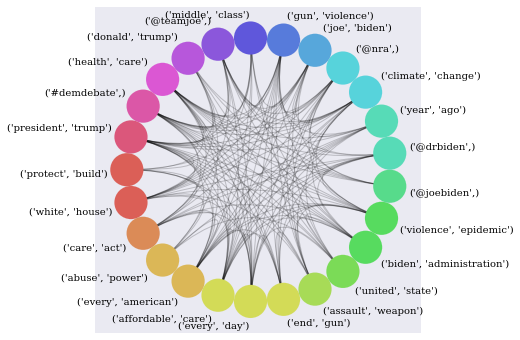
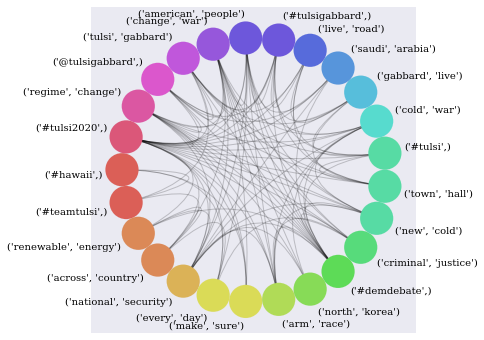

My goal will be be to use the Twitter API to import tweets related to a user or a hashtag. I will use Bag of Words (BOW) to create features on this data. Because more information is contained in terms than individual words I'll perform this analysis on bigrams not individual words. From these BOW features, also called terms, I will perform two analyses:  
1) I will find the most important terms. The way I will do this is by modeling the terms in a network with the terms as networks and co-occurence in tweets as edges. I'll then look for the terms with the highest centrality.  
2) I will perform Sentiment Analysis on the terms.  

I will perform Sentiment Analysis using words from a lexicon from this paper:

Minqing Hu and Bing Liu. "Mining and Summarizing Customer Reviews." Proceedings of the ACM SIGKDD International Conference on Knowledge Discovery and Data Mining (KDD-2004), Aug 22-25, 2004, Seattle, Washington, USA,

Because the politics is so top of mind for people nowadays I will do Twitter analysis against politicians: Donald Trump, Joe Biden, and Tulsi Gabbard.

Thanks to [Marco Bonzanini](https://marcobonzanini.com/2015/03/02/mining-twitter-data-with-python-part-1/) whose blog helped me a lot with the twitter data mining.

## Importing Libraries and Data


```python
# Import tweepy and json libraries
import tweepy
from tweepy import OAuthHandler
import json
```


```python
# Setting twitter credentials, to be removed before sharing
consumer_key = 'V8z7bzGEJXUhIf1yiJoPCxRog'
consumer_secret = 'b0mr1wUZXmPnvUFnncYyozqq7m25vVdf9qZzalr2auviQf7RLC'
access_token = '180036582-qo66jqNGdUDHITZ56JpaOSANbQbEzWbZ45YRrF0M'
access_secret = 'xPD4j1sqHhmAaHJacmJ5v4slN3lUu3tPYYXTeNfub02U8'

auth = OAuthHandler(consumer_key, consumer_secret)
auth.set_access_token(access_token, access_secret)

api = tweepy.API(auth, wait_on_rate_limit=True, wait_on_rate_limit_notify=True)
```


```python
# Basic analytical, visualization, and dataprocessing libraries
import numpy as np
import pandas as pd

from matplotlib import pyplot as plt
%matplotlib inline

import seaborn as sns
sns.set_style('darkgrid')

import time
import math
import string
from collections import defaultdict
```


```python
# Import language related libraries
from nltk.tokenize import word_tokenize
from nltk.tokenize import TweetTokenizer
import re
from collections import Counter
from nltk.corpus import stopwords
import string
from nltk.stem import WordNetLemmatizer
from nltk import bigrams
```


```python
# Import graph related libraries
import networkx as nx
from itertools import combinations
from nxviz import CircosPlot
from nxviz import ArcPlot
```

## Exploratory Analysis

I'll use tweepy to import data and do some initial analysis. I'll start with downloading some of my own timeline, about 20 tweets.


```python
# Download tweets
username = 'realDonaldTrump'
num_tweets = 400
exp_tweets = tweepy.Cursor(api.user_timeline, screen_name=username, tweet_mode='extended').items(num_tweets)
```


```python
full_text_list = [tweet.full_text for tweet in exp_tweets]
print(len(full_text_list))
```

    400


Generating features.


```python
# Text Preprocessing
tt = TweetTokenizer()

# Tokenize
exp_tokens = [tt.tokenize(tweet) for tweet in full_text_list]

# Lowercase
exp_lower = [[token.lower() for token in tweet] for tweet in exp_tokens]

# Remove stop words
punctuation = list(string.punctuation)
stop = stopwords.words('english') + punctuation + ['rt', 'via', "…", "’", '“', '”', "i'm"]
exp_no_stops = [[token for token in tweet if token not in stop] for tweet in exp_lower]

# Lemmatization
lemmatizer = WordNetLemmatizer()
exp_lemma = [[lemmatizer.lemmatize(token) for token in tweet] for tweet in exp_no_stops]

# Hashtags list
exp_hashtags = [[token for token in tweet if token.startswith('#')] for tweet in exp_lemma]

# Mentions list
exp_mentions = [[token for token in tweet if token.startswith('@')] for tweet in exp_lemma]

# Bigrams list
exp_no_at = [[token for token in tweet if not(token.startswith(('@', '#')))] for tweet in exp_lemma]
exp_bigrams = [list(bigrams(tweet)) for tweet in exp_no_at]
```


```python
# Generate features from common hashtags, mentions, and bigrams
limit = 5 # minimum count to be considered common

exp_count_hashtags = Counter()
exp_hashtags_flat = [item for sublist in exp_hashtags for item in sublist]
exp_count_hashtags.update(exp_hashtags_flat)
common_exp_hashtags = [((el,), value) for el, value in exp_count_hashtags.items() if value >=limit]

exp_count_mentions = Counter()
exp_mentions_flat = [item for sublist in exp_mentions for item in sublist]
exp_count_mentions.update(exp_mentions_flat)
common_exp_mentions = [((el,), value) for el, value in exp_count_mentions.items() if value >=limit]

exp_count_bigrams = Counter()
exp_bigrams_flat = [item for sublist in exp_bigrams for item in sublist]
exp_count_bigrams.update(exp_bigrams_flat)
common_exp_bigrams = [(el, value) for el, value in exp_count_bigrams.items() if value >=limit]

exp_features = common_exp_hashtags + common_exp_mentions + common_exp_bigrams
exp_features.sort(key=lambda x: x[1], reverse=True)
print(exp_features)
```

    [(('@realdonaldtrump',), 26), (('president', 'trump'), 15), (('united', 'state'), 14), (('@foxnews',), 13), (('nothing', 'democrat'), 13), (('@seanhannity',), 12), (('witch', 'hunt'), 12), (('adam', 'schiff'), 11), (('@whitehouse',), 10), (('@ivankatrump',), 10), (('fake', 'news'), 9), (('ukrainian', 'president'), 8), (('@danscavino',), 7), (('joe', 'biden'), 7), (('@mariabartiromo',), 6), (('@paulsperry_',), 6), (('history', 'country'), 6), (('john', 'bel'), 6), (('bel', 'edward'), 6), (('crooked', 'hillary'), 6), (('quid', 'pro'), 6), (('pro', 'quo'), 6), (('radical', 'left'), 6), (('american', 'people'), 6), (('#kag2020',), 5), (('@foxandfriends',), 5), (('@repmarkmeadows',), 5), (('@kimstrassel',), 5), (('@lindseygrahamsc',), 5), (('@greggjarrett',), 5), (('get', 'vote'), 5), (('republican', 'governor'), 5), (('minneapolis', 'minnesota'), 5), (('president', 'ukraine'), 5), (('nothing', 'wrong'), 5), (('sleepy', 'joe'), 5), (('republican', 'party'), 5), (('mitt', 'romney'), 5)]


Using features to generate a graph that can then be used to identify terms with high centrality.


```python
# Generate Graph
exp_G = nx.Graph()

# Generate Nodes
for feature, count in exp_features:
    exp_G.add_node(feature, count=count)

# Generate Edges based on Tweets
for node1, node2 in combinations(exp_G.nodes, 2):
    for tweet in exp_lemma:
        if set(node1).issubset(set(tweet)) and set(node2).issubset(set(tweet)):
            exp_G.add_edge(node1, node2)
```


```python
exp_C = CircosPlot(graph=exp_G, node_order='count', node_color='count', node_labels=True)
exp_C.draw()
plt.show()
```


```python
# High Level Graph Metrics and Analysis

print('Occurrence:', exp_features[:10])
print()
exp_degree_dict = nx.degree_centrality(exp_G)
exp_degree_sorted = sorted(exp_degree_dict.items(), key=lambda x: x[1], reverse=True)
print('Degree Centrality:', exp_degree_sorted[:5])
print()
exp_betweenness_dict = nx.betweenness_centrality(exp_G)
exp_betweenness_sorted = sorted(exp_betweenness_dict.items(), key=lambda x: x[1], reverse=True)
print('Betweenness Centrality:', exp_betweenness_sorted[:5])
print()
exp_pagerank_dict = nx.pagerank(exp_G)
exp_pagerank_sorted = sorted(exp_pagerank_dict.items(), key=lambda x: x[1], reverse=True)
print('PageRank:', exp_pagerank_sorted[:5])
print()
exp_cliques_sorted = sorted(list(nx.find_cliques(exp_G)), key=lambda x: len(x), reverse=True)
print('Largest Maximal Clique:', exp_cliques_sorted[0])
print()
exp_connected_subgraphs = list(nx.connected_component_subgraphs(exp_G))
exp_G_lccsg = max(exp_connected_subgraphs, key=lambda x: len(x))
print('Largest Connected Component Subgraph:', exp_G_lccsg.nodes)
```

    Occurrence: [(('@realdonaldtrump',), 26), (('president', 'trump'), 15), (('united', 'state'), 14), (('@foxnews',), 13), (('nothing', 'democrat'), 13), (('@seanhannity',), 12), (('witch', 'hunt'), 12), (('adam', 'schiff'), 11), (('@whitehouse',), 10), (('@ivankatrump',), 10)]

    Degree Centrality: [(('president', 'trump'), 0.40540540540540543), (('@realdonaldtrump',), 0.35135135135135137), (('united', 'state'), 0.32432432432432434), (('@foxnews',), 0.32432432432432434), (('president', 'ukraine'), 0.32432432432432434)]

    Betweenness Centrality: [(('@realdonaldtrump',), 0.1821835155168488), (('united', 'state'), 0.17838762422095755), (('president', 'trump'), 0.17531497948164612), (('nothing', 'democrat'), 0.08986916070249405), (('witch', 'hunt'), 0.06742086325419659)]

    PageRank: [(('president', 'trump'), 0.06479722982777351), (('@realdonaldtrump',), 0.06169025603100898), (('united', 'state'), 0.052267531027786585), (('@foxnews',), 0.049226748063565307), (('president', 'ukraine'), 0.048829800299260054)]

    Largest Maximal Clique: [('president', 'trump'), ('president', 'ukraine'), ('@foxnews',), ('@seanhannity',), ('quid', 'pro'), ('pro', 'quo')]

    Largest Connected Component Subgraph: [('@realdonaldtrump',), ('president', 'trump'), ('united', 'state'), ('@foxnews',), ('nothing', 'democrat'), ('@seanhannity',), ('witch', 'hunt'), ('adam', 'schiff'), ('@whitehouse',), ('fake', 'news'), ('ukrainian', 'president'), ('@danscavino',), ('joe', 'biden'), ('@mariabartiromo',), ('history', 'country'), ('john', 'bel'), ('bel', 'edward'), ('crooked', 'hillary'), ('quid', 'pro'), ('pro', 'quo'), ('radical', 'left'), ('american', 'people'), ('#kag2020',), ('@foxandfriends',), ('@repmarkmeadows',), ('@lindseygrahamsc',), ('@greggjarrett',), ('get', 'vote'), ('republican', 'governor'), ('minneapolis', 'minnesota'), ('president', 'ukraine'), ('nothing', 'wrong'), ('sleepy', 'joe'), ('republican', 'party'), ('mitt', 'romney')]


Interesting data particularly the Largest Maximal Clique: [('president', 'trump'), ('president', 'ukraine'), ('@foxnews',), ('@seanhannity',), ('quid', 'pro'), ('pro', 'quo')]. Obviously the ukraine investigation is something that Trump is tweeting a lot about, and he references @foxnews and @seanhannity often in the same tweets.


```python
# What kind of things does Trump say with regards to Joe Biden?
print(list(exp_G.neighbors(('joe', 'biden'))))
```

    [('@realdonaldtrump',), ('fake', 'news'), ('@greggjarrett',), ('nothing', 'wrong'), ('sleepy', 'joe')]


Let's do some sentiment analysis and see what Trump talks about positiviely and negatively.


```python
# For sentiment analysis, creating positive and negative words from Hu-Liu lexicon, citation above
def load_words(file_name):
    print('Loading word list from file...')
    inFile = open(file_name, 'r')
    wordlist = []
    for line in inFile:
        wordlist.append(line.strip().lower())
    print(len(wordlist), 'words loaded.')
    return wordlist

positive_words = load_words('positive-words-raw.txt')
negative_words = load_words('negative-words-raw.txt')
```

    Loading word list from file...
    2006 words loaded.
    Loading word list from file...
    4783 words loaded.


```python
# trump itself is a positive word in this lexicon but this will be wrong in this context
positive_words.remove('trump')
len(positive_words)
```


    2005


```python
# The positive words that Trump uses a lot
exp_pos_counts = defaultdict(lambda: defaultdict(int))
for positive_word in positive_words:
    for tweet in exp_lemma:
        if set([positive_word]).issubset(set(tweet)):
            exp_pos_counts[(positive_word,)]['count'] += 1
exp_pos_counts_df = pd.DataFrame(exp_pos_counts)
exp_pos_counts_df = exp_pos_counts_df.transpose()
exp_pos_counts_df.sort_values('count', inplace=True, ascending=False)
exp_pos_counts_df.head()
```


<div>
<style scoped>
    .dataframe tbody tr th:only-of-type {
        vertical-align: middle;
    }

    .dataframe tbody tr th {
        vertical-align: top;
    }

    .dataframe thead th {
        text-align: right;
    }
</style>
<table border="1" class="dataframe">
  <thead>
    <tr style="text-align: right;">
      <th></th>
      <th>count</th>
    </tr>
  </thead>
  <tbody>
    <tr>
      <th>great</th>
      <td>56</td>
    </tr>
    <tr>
      <th>thank</th>
      <td>24</td>
    </tr>
    <tr>
      <th>good</th>
      <td>14</td>
    </tr>
    <tr>
      <th>win</th>
      <td>12</td>
    </tr>
    <tr>
      <th>love</th>
      <td>10</td>
    </tr>
  </tbody>
</table>
</div>


```python
# The negative words that trump uses a lot
exp_neg_counts = defaultdict(lambda: defaultdict(int))
for negative_word in negative_words:
    for tweet in exp_lemma:
        if set([negative_word]).issubset(set(tweet)):
            exp_neg_counts[(negative_word,)]['count'] += 1
exp_neg_counts_df = pd.DataFrame(exp_neg_counts)
exp_neg_counts_df = exp_neg_counts_df.transpose()
exp_neg_counts_df.sort_values('count', inplace=True, ascending=False)
exp_neg_counts_df.head()
```


<div>
<style scoped>
    .dataframe tbody tr th:only-of-type {
        vertical-align: middle;
    }

    .dataframe tbody tr th {
        vertical-align: top;
    }

    .dataframe thead th {
        text-align: right;
    }
</style>
<table border="1" class="dataframe">
  <thead>
    <tr style="text-align: right;">
      <th></th>
      <th>count</th>
    </tr>
  </thead>
  <tbody>
    <tr>
      <th>scam</th>
      <td>13</td>
    </tr>
    <tr>
      <th>wrong</th>
      <td>10</td>
    </tr>
    <tr>
      <th>fake</th>
      <td>10</td>
    </tr>
    <tr>
      <th>crime</th>
      <td>10</td>
    </tr>
    <tr>
      <th>bad</th>
      <td>9</td>
    </tr>
  </tbody>
</table>
</div>


```python
# How often the BOW terms occur (will be used for a conditional probability analysis below)
exp_feature_counts = defaultdict(lambda: defaultdict(int))
for feature, count in exp_features:
    for tweet in exp_lemma:
        if set(feature).issubset(set(tweet)):
            exp_feature_counts[feature]['count'] += 1
exp_feature_counts_df = pd.DataFrame(exp_feature_counts)
exp_feature_counts_df = exp_feature_counts_df.transpose()
exp_feature_counts_df.sort_values('count')
exp_feature_counts_df.head()
```


<div>
<style scoped>
    .dataframe tbody tr th:only-of-type {
        vertical-align: middle;
    }

    .dataframe tbody tr th {
        vertical-align: top;
    }

    .dataframe thead th {
        text-align: right;
    }
</style>
<table border="1" class="dataframe">
  <thead>
    <tr style="text-align: right;">
      <th></th>
      <th></th>
      <th>count</th>
    </tr>
  </thead>
  <tbody>
    <tr>
      <th>@realdonaldtrump</th>
      <th>NaN</th>
      <td>26</td>
    </tr>
    <tr>
      <th>president</th>
      <th>trump</th>
      <td>18</td>
    </tr>
    <tr>
      <th>united</th>
      <th>state</th>
      <td>14</td>
    </tr>
    <tr>
      <th>@foxnews</th>
      <th>NaN</th>
      <td>12</td>
    </tr>
    <tr>
      <th>nothing</th>
      <th>democrat</th>
      <td>14</td>
    </tr>
  </tbody>
</table>
</div>


```python
# Calculating co-occurences of positive and negative terms along with our BOW terms
# Then using the frequency individual occurrences of BOW terms, positive words, negative words we can generate conditional probabilities
# Using the conditional probabilities of BOW terms along with positive and negative words I calculate a metric called the PMI

sentiment_df = pd.DataFrame({}, columns=['feature', 'sentiment_word', 'sentiment_type', 'feature_count', 'sentiment_count', 'co-occurrences_count', 'PMI'])
exp_co_term_counts = defaultdict(lambda: defaultdict(int))
pmi_dict = defaultdict(lambda: defaultdict(int))

for feature, feature_count in exp_feature_counts.items():
    for positive_word, sentiment_count in exp_pos_counts.items():
        for tweet in exp_lemma:
            if set(feature).issubset(tweet) and set(positive_word).issubset(tweet):
                exp_co_term_counts[feature][positive_word]+=1
        if exp_co_term_counts[feature][positive_word] == 0:
            pmi_dict[feature][positive_word] = 0
        else:
            num_tweets = len(exp_lemma)
            pmi_numerator = exp_co_term_counts[feature][positive_word]/num_tweets
            pmi_denomonator = (feature_count['count']/num_tweets)*(sentiment_count['count']/num_tweets)
            pmi_dict[feature][positive_word] = math.log2(pmi_numerator/pmi_denomonator)
        sentiment_df = sentiment_df.append({
            'feature': feature,
            'sentiment_word': positive_word,
            'sentiment_type': 'positive',
            'feature_count': feature_count['count'],
            'sentiment_count': sentiment_count['count'],
            'co-occurrences_count': exp_co_term_counts[feature][positive_word],
            'PMI': pmi_dict[feature][positive_word]
        }, ignore_index=True)

for feature, feature_count in exp_feature_counts.items():
    for negative_word, sentiment_count in exp_neg_counts.items():
        for tweet in exp_lemma:
            if set(feature).issubset(tweet) and set(negative_word).issubset(tweet):
                exp_co_term_counts[feature][negative_word]+=1
        if exp_co_term_counts[feature][negative_word] == 0:
            pmi_dict[feature][negative_word] = 0
        else:
            num_tweets = len(exp_lemma)
            pmi_numerator = exp_co_term_counts[feature][negative_word]/num_tweets
            pmi_denomonator = (feature_count['count']/num_tweets)*(sentiment_count['count']/num_tweets)
            pmi_dict[feature][negative_word] = math.log2(pmi_numerator/pmi_denomonator)
        sentiment_df = sentiment_df.append({
            'feature': feature,
            'sentiment_word': negative_word,
            'sentiment_type': 'negative',
            'feature_count': feature_count['count'],
            'sentiment_count': sentiment_count['count'],
            'co-occurrences_count': exp_co_term_counts[feature][negative_word],
            'PMI': pmi_dict[feature][negative_word]
        }, ignore_index=True)

sentiment_df.sort_values('PMI', ascending=False).head(40)
```


<div>
<style scoped>
    .dataframe tbody tr th:only-of-type {
        vertical-align: middle;
    }

    .dataframe tbody tr th {
        vertical-align: top;
    }

    .dataframe thead th {
        text-align: right;
    }
</style>
<table border="1" class="dataframe">
  <thead>
    <tr style="text-align: right;">
      <th></th>
      <th>feature</th>
      <th>sentiment_word</th>
      <th>sentiment_type</th>
      <th>feature_count</th>
      <th>sentiment_count</th>
      <th>co-occurrences_count</th>
      <th>PMI</th>
    </tr>
  </thead>
  <tbody>
    <tr>
      <th>11727</th>
      <td>(mitt, romney)</td>
      <td>(pompous,)</td>
      <td>negative</td>
      <td>5</td>
      <td>2</td>
      <td>2</td>
      <td>6.32193</td>
    </tr>
    <tr>
      <th>4283</th>
      <td>(republican, party)</td>
      <td>(fabulous,)</td>
      <td>positive</td>
      <td>5</td>
      <td>1</td>
      <td>1</td>
      <td>6.32193</td>
    </tr>
    <tr>
      <th>11133</th>
      <td>(nothing, wrong)</td>
      <td>(meltdown,)</td>
      <td>negative</td>
      <td>5</td>
      <td>1</td>
      <td>1</td>
      <td>6.32193</td>
    </tr>
    <tr>
      <th>4025</th>
      <td>(nothing, wrong)</td>
      <td>(bright,)</td>
      <td>positive</td>
      <td>5</td>
      <td>1</td>
      <td>1</td>
      <td>6.32193</td>
    </tr>
    <tr>
      <th>11284</th>
      <td>(sleepy, joe)</td>
      <td>(hang,)</td>
      <td>negative</td>
      <td>5</td>
      <td>1</td>
      <td>1</td>
      <td>6.32193</td>
    </tr>
    <tr>
      <th>11356</th>
      <td>(sleepy, joe)</td>
      <td>(ripped,)</td>
      <td>negative</td>
      <td>5</td>
      <td>1</td>
      <td>1</td>
      <td>6.32193</td>
    </tr>
    <tr>
      <th>11702</th>
      <td>(mitt, romney)</td>
      <td>(losing,)</td>
      <td>negative</td>
      <td>5</td>
      <td>1</td>
      <td>1</td>
      <td>6.32193</td>
    </tr>
    <tr>
      <th>11248</th>
      <td>(sleepy, joe)</td>
      <td>(detriment,)</td>
      <td>negative</td>
      <td>5</td>
      <td>1</td>
      <td>1</td>
      <td>6.32193</td>
    </tr>
    <tr>
      <th>9766</th>
      <td>(@kimstrassel,)</td>
      <td>(insanity,)</td>
      <td>negative</td>
      <td>5</td>
      <td>1</td>
      <td>1</td>
      <td>6.32193</td>
    </tr>
    <tr>
      <th>11706</th>
      <td>(mitt, romney)</td>
      <td>(lousy,)</td>
      <td>negative</td>
      <td>5</td>
      <td>1</td>
      <td>1</td>
      <td>6.32193</td>
    </tr>
    <tr>
      <th>4395</th>
      <td>(mitt, romney)</td>
      <td>(endorse,)</td>
      <td>positive</td>
      <td>5</td>
      <td>1</td>
      <td>1</td>
      <td>6.32193</td>
    </tr>
    <tr>
      <th>4088</th>
      <td>(nothing, wrong)</td>
      <td>(pretty,)</td>
      <td>positive</td>
      <td>5</td>
      <td>1</td>
      <td>1</td>
      <td>6.32193</td>
    </tr>
    <tr>
      <th>11744</th>
      <td>(mitt, romney)</td>
      <td>(sadly,)</td>
      <td>negative</td>
      <td>5</td>
      <td>1</td>
      <td>1</td>
      <td>6.32193</td>
    </tr>
    <tr>
      <th>11301</th>
      <td>(sleepy, joe)</td>
      <td>(inexcusable,)</td>
      <td>negative</td>
      <td>5</td>
      <td>1</td>
      <td>1</td>
      <td>6.32193</td>
    </tr>
    <tr>
      <th>3538</th>
      <td>(@greggjarrett,)</td>
      <td>(worthy,)</td>
      <td>positive</td>
      <td>5</td>
      <td>1</td>
      <td>1</td>
      <td>6.32193</td>
    </tr>
    <tr>
      <th>3350</th>
      <td>(@lindseygrahamsc,)</td>
      <td>(helped,)</td>
      <td>positive</td>
      <td>5</td>
      <td>1</td>
      <td>1</td>
      <td>6.32193</td>
    </tr>
    <tr>
      <th>10088</th>
      <td>(@greggjarrett,)</td>
      <td>(delusion,)</td>
      <td>negative</td>
      <td>5</td>
      <td>1</td>
      <td>1</td>
      <td>6.32193</td>
    </tr>
    <tr>
      <th>11712</th>
      <td>(mitt, romney)</td>
      <td>(mistake,)</td>
      <td>negative</td>
      <td>5</td>
      <td>1</td>
      <td>1</td>
      <td>6.32193</td>
    </tr>
    <tr>
      <th>11164</th>
      <td>(nothing, wrong)</td>
      <td>(ripped,)</td>
      <td>negative</td>
      <td>5</td>
      <td>1</td>
      <td>1</td>
      <td>6.32193</td>
    </tr>
    <tr>
      <th>11056</th>
      <td>(nothing, wrong)</td>
      <td>(detriment,)</td>
      <td>negative</td>
      <td>5</td>
      <td>1</td>
      <td>1</td>
      <td>6.32193</td>
    </tr>
    <tr>
      <th>9876</th>
      <td>(@lindseygrahamsc,)</td>
      <td>(complaint,)</td>
      <td>negative</td>
      <td>5</td>
      <td>1</td>
      <td>1</td>
      <td>6.32193</td>
    </tr>
    <tr>
      <th>7865</th>
      <td>(john, bel)</td>
      <td>(loud,)</td>
      <td>negative</td>
      <td>6</td>
      <td>1</td>
      <td>1</td>
      <td>6.05889</td>
    </tr>
    <tr>
      <th>9054</th>
      <td>(american, people)</td>
      <td>(ruthless,)</td>
      <td>negative</td>
      <td>6</td>
      <td>1</td>
      <td>1</td>
      <td>6.05889</td>
    </tr>
    <tr>
      <th>7716</th>
      <td>(history, country)</td>
      <td>(slowly,)</td>
      <td>negative</td>
      <td>6</td>
      <td>1</td>
      <td>1</td>
      <td>6.05889</td>
    </tr>
    <tr>
      <th>8080</th>
      <td>(bel, edward)</td>
      <td>(poor,)</td>
      <td>negative</td>
      <td>6</td>
      <td>1</td>
      <td>1</td>
      <td>6.05889</td>
    </tr>
    <tr>
      <th>7888</th>
      <td>(john, bel)</td>
      <td>(poor,)</td>
      <td>negative</td>
      <td>6</td>
      <td>1</td>
      <td>1</td>
      <td>6.05889</td>
    </tr>
    <tr>
      <th>7342</th>
      <td>(@mariabartiromo,)</td>
      <td>(suicide,)</td>
      <td>negative</td>
      <td>6</td>
      <td>1</td>
      <td>1</td>
      <td>6.05889</td>
    </tr>
    <tr>
      <th>8871</th>
      <td>(radical, left)</td>
      <td>(stifle,)</td>
      <td>negative</td>
      <td>6</td>
      <td>1</td>
      <td>1</td>
      <td>6.05889</td>
    </tr>
    <tr>
      <th>1964</th>
      <td>(history, country)</td>
      <td>(pretty,)</td>
      <td>positive</td>
      <td>6</td>
      <td>1</td>
      <td>1</td>
      <td>6.05889</td>
    </tr>
    <tr>
      <th>8346</th>
      <td>(quid, pro)</td>
      <td>(controversial,)</td>
      <td>negative</td>
      <td>6</td>
      <td>1</td>
      <td>1</td>
      <td>6.05889</td>
    </tr>
    <tr>
      <th>8342</th>
      <td>(quid, pro)</td>
      <td>(concern,)</td>
      <td>negative</td>
      <td>6</td>
      <td>1</td>
      <td>1</td>
      <td>6.05889</td>
    </tr>
    <tr>
      <th>8332</th>
      <td>(quid, pro)</td>
      <td>(blackmail,)</td>
      <td>negative</td>
      <td>6</td>
      <td>1</td>
      <td>1</td>
      <td>6.05889</td>
    </tr>
    <tr>
      <th>8111</th>
      <td>(bel, edward)</td>
      <td>(suspect,)</td>
      <td>negative</td>
      <td>6</td>
      <td>1</td>
      <td>1</td>
      <td>6.05889</td>
    </tr>
    <tr>
      <th>7919</th>
      <td>(john, bel)</td>
      <td>(suspect,)</td>
      <td>negative</td>
      <td>6</td>
      <td>1</td>
      <td>1</td>
      <td>6.05889</td>
    </tr>
    <tr>
      <th>7366</th>
      <td>(@paulsperry_,)</td>
      <td>(accuse,)</td>
      <td>negative</td>
      <td>6</td>
      <td>1</td>
      <td>1</td>
      <td>6.05889</td>
    </tr>
    <tr>
      <th>2791</th>
      <td>(american, people)</td>
      <td>(promise,)</td>
      <td>positive</td>
      <td>6</td>
      <td>1</td>
      <td>1</td>
      <td>6.05889</td>
    </tr>
    <tr>
      <th>8524</th>
      <td>(pro, quo)</td>
      <td>(blackmail,)</td>
      <td>negative</td>
      <td>6</td>
      <td>1</td>
      <td>1</td>
      <td>6.05889</td>
    </tr>
    <tr>
      <th>7599</th>
      <td>(history, country)</td>
      <td>(destruction,)</td>
      <td>negative</td>
      <td>6</td>
      <td>1</td>
      <td>1</td>
      <td>6.05889</td>
    </tr>
    <tr>
      <th>8538</th>
      <td>(pro, quo)</td>
      <td>(controversial,)</td>
      <td>negative</td>
      <td>6</td>
      <td>1</td>
      <td>1</td>
      <td>6.05889</td>
    </tr>
    <tr>
      <th>1664</th>
      <td>(@mariabartiromo,)</td>
      <td>(boom,)</td>
      <td>positive</td>
      <td>6</td>
      <td>1</td>
      <td>1</td>
      <td>6.05889</td>
    </tr>
  </tbody>
</table>
</div>


```python
# Adding up PMI gives an overall sentiment score called Semantic Orientation for the BOW terms
semantic_orientation = defaultdict(int)
for _, row in sentiment_df.iterrows():
    if row.sentiment_type=='positive':
        semantic_orientation[row.feature] = semantic_orientation[row.feature] + row.PMI
    elif row.sentiment_type=='negative':
        semantic_orientation[row.feature] = semantic_orientation[row.feature] - row.PMI
    else:
        print('error, missing semantic_orientation')
```


```python
# Here are the ten most positive and the ten most negative terms in Trump Tweets
semantic_sorted = sorted(semantic_orientation.items(), key=lambda x:x[1], reverse=True)
top_pos = semantic_sorted[:10]
top_neg = semantic_sorted[-10:]
print('Top Pos:', top_pos)
print('Top Neg:', top_neg)
```

    Top Pos: [(('republican', 'governor'), 34.758532095419035), (('@ivankatrump',), 26.024677973715658), (('get', 'vote'), 25.7521058262596), (('republican', 'party'), 24.883899317932862), (('minneapolis', 'minnesota'), 13.106291739269306), (('fake', 'news'), 5.548766421254989), (('@greggjarrett',), 4.7369655941662066), (('#kag2020',), 4.403541860441016), (('@danscavino',), 3.251538766995964), (('@lindseygrahamsc',), 2.999999999999999)]
    Top Neg: [(('@mariabartiromo',), -28.446471538712892), (('joe', 'biden'), -30.863137138648344), (('sleepy', 'joe'), -31.609640474436812), (('president', 'ukraine'), -34.885007483150986), (('nothing', 'democrat'), -43.36596593837737), (('@seanhannity',), -47.110889593731045), (('ukrainian', 'president'), -48.375552100221434), (('@foxnews',), -53.947720658007135), (('president', 'trump'), -57.65364060468163), (('adam', 'schiff'), -73.21751112955931)]


You can see the people, the groups, and the ideas that Trump talks about positively and negatively. For example he speaks positively about his daughter, and negatively about Joe Biden. Oddly Fox News is among the top negative terms. Let's look at that more closely.


```python
sentiment_df.loc[sentiment_df['feature'] == ('@foxnews',)].sort_values('PMI', ascending=False)
```


<div>
<style scoped>
    .dataframe tbody tr th:only-of-type {
        vertical-align: middle;
    }

    .dataframe tbody tr th {
        vertical-align: top;
    }

    .dataframe thead th {
        text-align: right;
    }
</style>
<table border="1" class="dataframe">
  <thead>
    <tr style="text-align: right;">
      <th></th>
      <th>feature</th>
      <th>sentiment_word</th>
      <th>sentiment_type</th>
      <th>feature_count</th>
      <th>sentiment_count</th>
      <th>co-occurrences_count</th>
      <th>PMI</th>
    </tr>
  </thead>
  <tbody>
    <tr>
      <th>5153</th>
      <td>(@foxnews,)</td>
      <td>(impossible,)</td>
      <td>negative</td>
      <td>12</td>
      <td>1</td>
      <td>1</td>
      <td>5.05889</td>
    </tr>
    <tr>
      <th>5227</th>
      <td>(@foxnews,)</td>
      <td>(suck,)</td>
      <td>negative</td>
      <td>12</td>
      <td>1</td>
      <td>1</td>
      <td>5.05889</td>
    </tr>
    <tr>
      <th>5078</th>
      <td>(@foxnews,)</td>
      <td>(concern,)</td>
      <td>negative</td>
      <td>12</td>
      <td>1</td>
      <td>1</td>
      <td>5.05889</td>
    </tr>
    <tr>
      <th>5098</th>
      <td>(@foxnews,)</td>
      <td>(denied,)</td>
      <td>negative</td>
      <td>12</td>
      <td>1</td>
      <td>1</td>
      <td>5.05889</td>
    </tr>
    <tr>
      <th>5144</th>
      <td>(@foxnews,)</td>
      <td>(horrible,)</td>
      <td>negative</td>
      <td>12</td>
      <td>1</td>
      <td>1</td>
      <td>5.05889</td>
    </tr>
    <tr>
      <th>5114</th>
      <td>(@foxnews,)</td>
      <td>(doubt,)</td>
      <td>negative</td>
      <td>12</td>
      <td>1</td>
      <td>1</td>
      <td>5.05889</td>
    </tr>
    <tr>
      <th>5192</th>
      <td>(@foxnews,)</td>
      <td>(outrage,)</td>
      <td>negative</td>
      <td>12</td>
      <td>1</td>
      <td>1</td>
      <td>5.05889</td>
    </tr>
    <tr>
      <th>5083</th>
      <td>(@foxnews,)</td>
      <td>(controversy,)</td>
      <td>negative</td>
      <td>12</td>
      <td>1</td>
      <td>1</td>
      <td>5.05889</td>
    </tr>
    <tr>
      <th>454</th>
      <td>(@foxnews,)</td>
      <td>(supreme,)</td>
      <td>positive</td>
      <td>12</td>
      <td>2</td>
      <td>1</td>
      <td>4.05889</td>
    </tr>
    <tr>
      <th>372</th>
      <td>(@foxnews,)</td>
      <td>(congenial,)</td>
      <td>positive</td>
      <td>12</td>
      <td>3</td>
      <td>1</td>
      <td>3.47393</td>
    </tr>
    <tr>
      <th>5232</th>
      <td>(@foxnews,)</td>
      <td>(terrible,)</td>
      <td>negative</td>
      <td>12</td>
      <td>3</td>
      <td>1</td>
      <td>3.47393</td>
    </tr>
    <tr>
      <th>5233</th>
      <td>(@foxnews,)</td>
      <td>(treason,)</td>
      <td>negative</td>
      <td>12</td>
      <td>3</td>
      <td>1</td>
      <td>3.47393</td>
    </tr>
    <tr>
      <th>5226</th>
      <td>(@foxnews,)</td>
      <td>(subpoena,)</td>
      <td>negative</td>
      <td>12</td>
      <td>4</td>
      <td>1</td>
      <td>3.05889</td>
    </tr>
    <tr>
      <th>5087</th>
      <td>(@foxnews,)</td>
      <td>(crazy,)</td>
      <td>negative</td>
      <td>12</td>
      <td>5</td>
      <td>1</td>
      <td>2.73697</td>
    </tr>
    <tr>
      <th>468</th>
      <td>(@foxnews,)</td>
      <td>(work,)</td>
      <td>positive</td>
      <td>12</td>
      <td>5</td>
      <td>1</td>
      <td>2.73697</td>
    </tr>
    <tr>
      <th>5210</th>
      <td>(@foxnews,)</td>
      <td>(ridiculous,)</td>
      <td>negative</td>
      <td>12</td>
      <td>6</td>
      <td>1</td>
      <td>2.47393</td>
    </tr>
    <tr>
      <th>5151</th>
      <td>(@foxnews,)</td>
      <td>(impeach,)</td>
      <td>negative</td>
      <td>12</td>
      <td>6</td>
      <td>1</td>
      <td>2.47393</td>
    </tr>
    <tr>
      <th>5135</th>
      <td>(@foxnews,)</td>
      <td>(fraud,)</td>
      <td>negative</td>
      <td>12</td>
      <td>6</td>
      <td>1</td>
      <td>2.47393</td>
    </tr>
    <tr>
      <th>462</th>
      <td>(@foxnews,)</td>
      <td>(well,)</td>
      <td>positive</td>
      <td>12</td>
      <td>7</td>
      <td>1</td>
      <td>2.25154</td>
    </tr>
    <tr>
      <th>5093</th>
      <td>(@foxnews,)</td>
      <td>(crooked,)</td>
      <td>negative</td>
      <td>12</td>
      <td>7</td>
      <td>1</td>
      <td>2.25154</td>
    </tr>
    <tr>
      <th>5141</th>
      <td>(@foxnews,)</td>
      <td>(hard,)</td>
      <td>negative</td>
      <td>12</td>
      <td>8</td>
      <td>1</td>
      <td>2.05889</td>
    </tr>
    <tr>
      <th>418</th>
      <td>(@foxnews,)</td>
      <td>(like,)</td>
      <td>positive</td>
      <td>12</td>
      <td>8</td>
      <td>1</td>
      <td>2.05889</td>
    </tr>
    <tr>
      <th>5089</th>
      <td>(@foxnews,)</td>
      <td>(crime,)</td>
      <td>negative</td>
      <td>12</td>
      <td>10</td>
      <td>1</td>
      <td>1.73697</td>
    </tr>
    <tr>
      <th>5125</th>
      <td>(@foxnews,)</td>
      <td>(fake,)</td>
      <td>negative</td>
      <td>12</td>
      <td>10</td>
      <td>1</td>
      <td>1.73697</td>
    </tr>
    <tr>
      <th>5217</th>
      <td>(@foxnews,)</td>
      <td>(scam,)</td>
      <td>negative</td>
      <td>12</td>
      <td>13</td>
      <td>1</td>
      <td>1.35845</td>
    </tr>
    <tr>
      <th>396</th>
      <td>(@foxnews,)</td>
      <td>(good,)</td>
      <td>positive</td>
      <td>12</td>
      <td>14</td>
      <td>1</td>
      <td>1.25154</td>
    </tr>
    <tr>
      <th>5140</th>
      <td>(@foxnews,)</td>
      <td>(hang,)</td>
      <td>negative</td>
      <td>12</td>
      <td>1</td>
      <td>0</td>
      <td>0</td>
    </tr>
    <tr>
      <th>5155</th>
      <td>(@foxnews,)</td>
      <td>(incapable,)</td>
      <td>negative</td>
      <td>12</td>
      <td>1</td>
      <td>0</td>
      <td>0</td>
    </tr>
    <tr>
      <th>5142</th>
      <td>(@foxnews,)</td>
      <td>(hate,)</td>
      <td>negative</td>
      <td>12</td>
      <td>2</td>
      <td>0</td>
      <td>0</td>
    </tr>
    <tr>
      <th>5143</th>
      <td>(@foxnews,)</td>
      <td>(hoax,)</td>
      <td>negative</td>
      <td>12</td>
      <td>1</td>
      <td>0</td>
      <td>0</td>
    </tr>
    <tr>
      <th>...</th>
      <td>...</td>
      <td>...</td>
      <td>...</td>
      <td>...</td>
      <td>...</td>
      <td>...</td>
      <td>...</td>
    </tr>
    <tr>
      <th>444</th>
      <td>(@foxnews,)</td>
      <td>(significant,)</td>
      <td>positive</td>
      <td>12</td>
      <td>1</td>
      <td>0</td>
      <td>0</td>
    </tr>
    <tr>
      <th>443</th>
      <td>(@foxnews,)</td>
      <td>(sharp,)</td>
      <td>positive</td>
      <td>12</td>
      <td>1</td>
      <td>0</td>
      <td>0</td>
    </tr>
    <tr>
      <th>442</th>
      <td>(@foxnews,)</td>
      <td>(secure,)</td>
      <td>positive</td>
      <td>12</td>
      <td>2</td>
      <td>0</td>
      <td>0</td>
    </tr>
    <tr>
      <th>441</th>
      <td>(@foxnews,)</td>
      <td>(saint,)</td>
      <td>positive</td>
      <td>12</td>
      <td>1</td>
      <td>0</td>
      <td>0</td>
    </tr>
    <tr>
      <th>440</th>
      <td>(@foxnews,)</td>
      <td>(safe,)</td>
      <td>positive</td>
      <td>12</td>
      <td>1</td>
      <td>0</td>
      <td>0</td>
    </tr>
    <tr>
      <th>439</th>
      <td>(@foxnews,)</td>
      <td>(right,)</td>
      <td>positive</td>
      <td>12</td>
      <td>10</td>
      <td>0</td>
      <td>0</td>
    </tr>
    <tr>
      <th>438</th>
      <td>(@foxnews,)</td>
      <td>(relief,)</td>
      <td>positive</td>
      <td>12</td>
      <td>1</td>
      <td>0</td>
      <td>0</td>
    </tr>
    <tr>
      <th>437</th>
      <td>(@foxnews,)</td>
      <td>(recover,)</td>
      <td>positive</td>
      <td>12</td>
      <td>1</td>
      <td>0</td>
      <td>0</td>
    </tr>
    <tr>
      <th>436</th>
      <td>(@foxnews,)</td>
      <td>(pure,)</td>
      <td>positive</td>
      <td>12</td>
      <td>2</td>
      <td>0</td>
      <td>0</td>
    </tr>
    <tr>
      <th>435</th>
      <td>(@foxnews,)</td>
      <td>(proven,)</td>
      <td>positive</td>
      <td>12</td>
      <td>1</td>
      <td>0</td>
      <td>0</td>
    </tr>
    <tr>
      <th>434</th>
      <td>(@foxnews,)</td>
      <td>(protection,)</td>
      <td>positive</td>
      <td>12</td>
      <td>1</td>
      <td>0</td>
      <td>0</td>
    </tr>
    <tr>
      <th>449</th>
      <td>(@foxnews,)</td>
      <td>(stronger,)</td>
      <td>positive</td>
      <td>12</td>
      <td>2</td>
      <td>0</td>
      <td>0</td>
    </tr>
    <tr>
      <th>450</th>
      <td>(@foxnews,)</td>
      <td>(strongest,)</td>
      <td>positive</td>
      <td>12</td>
      <td>2</td>
      <td>0</td>
      <td>0</td>
    </tr>
    <tr>
      <th>451</th>
      <td>(@foxnews,)</td>
      <td>(success,)</td>
      <td>positive</td>
      <td>12</td>
      <td>1</td>
      <td>0</td>
      <td>0</td>
    </tr>
    <tr>
      <th>461</th>
      <td>(@foxnews,)</td>
      <td>(warmer,)</td>
      <td>positive</td>
      <td>12</td>
      <td>1</td>
      <td>0</td>
      <td>0</td>
    </tr>
    <tr>
      <th>469</th>
      <td>(@foxnews,)</td>
      <td>(worked,)</td>
      <td>positive</td>
      <td>12</td>
      <td>3</td>
      <td>0</td>
      <td>0</td>
    </tr>
    <tr>
      <th>467</th>
      <td>(@foxnews,)</td>
      <td>(wonderful,)</td>
      <td>positive</td>
      <td>12</td>
      <td>4</td>
      <td>0</td>
      <td>0</td>
    </tr>
    <tr>
      <th>466</th>
      <td>(@foxnews,)</td>
      <td>(wisdom,)</td>
      <td>positive</td>
      <td>12</td>
      <td>1</td>
      <td>0</td>
      <td>0</td>
    </tr>
    <tr>
      <th>465</th>
      <td>(@foxnews,)</td>
      <td>(winning,)</td>
      <td>positive</td>
      <td>12</td>
      <td>2</td>
      <td>0</td>
      <td>0</td>
    </tr>
    <tr>
      <th>464</th>
      <td>(@foxnews,)</td>
      <td>(win,)</td>
      <td>positive</td>
      <td>12</td>
      <td>12</td>
      <td>0</td>
      <td>0</td>
    </tr>
    <tr>
      <th>463</th>
      <td>(@foxnews,)</td>
      <td>(willing,)</td>
      <td>positive</td>
      <td>12</td>
      <td>2</td>
      <td>0</td>
      <td>0</td>
    </tr>
    <tr>
      <th>460</th>
      <td>(@foxnews,)</td>
      <td>(victory,)</td>
      <td>positive</td>
      <td>12</td>
      <td>1</td>
      <td>0</td>
      <td>0</td>
    </tr>
    <tr>
      <th>452</th>
      <td>(@foxnews,)</td>
      <td>(support,)</td>
      <td>positive</td>
      <td>12</td>
      <td>6</td>
      <td>0</td>
      <td>0</td>
    </tr>
    <tr>
      <th>459</th>
      <td>(@foxnews,)</td>
      <td>(unmatched,)</td>
      <td>positive</td>
      <td>12</td>
      <td>1</td>
      <td>0</td>
      <td>0</td>
    </tr>
    <tr>
      <th>458</th>
      <td>(@foxnews,)</td>
      <td>(trust,)</td>
      <td>positive</td>
      <td>12</td>
      <td>1</td>
      <td>0</td>
      <td>0</td>
    </tr>
    <tr>
      <th>457</th>
      <td>(@foxnews,)</td>
      <td>(tough,)</td>
      <td>positive</td>
      <td>12</td>
      <td>3</td>
      <td>0</td>
      <td>0</td>
    </tr>
    <tr>
      <th>456</th>
      <td>(@foxnews,)</td>
      <td>(top,)</td>
      <td>positive</td>
      <td>12</td>
      <td>1</td>
      <td>0</td>
      <td>0</td>
    </tr>
    <tr>
      <th>455</th>
      <td>(@foxnews,)</td>
      <td>(thank,)</td>
      <td>positive</td>
      <td>12</td>
      <td>24</td>
      <td>0</td>
      <td>0</td>
    </tr>
    <tr>
      <th>453</th>
      <td>(@foxnews,)</td>
      <td>(supporter,)</td>
      <td>positive</td>
      <td>12</td>
      <td>2</td>
      <td>0</td>
      <td>0</td>
    </tr>
    <tr>
      <th>5251</th>
      <td>(@foxnews,)</td>
      <td>(wrong,)</td>
      <td>negative</td>
      <td>12</td>
      <td>10</td>
      <td>0</td>
      <td>0</td>
    </tr>
  </tbody>
</table>
<p>310 rows × 7 columns</p>
</div>


Seems like maybe he is saying negative things about other people or things and then mentioning Fox News in the same tweets.

## Define Functions: Download and Clean Data, Feature Engineering

These functions make it easier to do the steps necessary before analysis of the features.


```python
def download_tweets(search_term, num_tweets=100):
    if search_term.startswith('#'):
        print(f'Hashtag: {search_term}')
        tweets = tweepy.Cursor(api.search, query=search_term, tweet_mode='extended').items(num_tweets)
    elif search_term.startswith('@'):
        print(f'User: {search_term}')
        tweets = tweepy.Cursor(api.user_timeline, screen_name=search_term, tweet_mode='extended').items(num_tweets)   
    else:
        print('Please enter a hashtag starting with "#", or a username starting with "@"')
    time.sleep(15)
    tweets_list=list(tweets)
    print(f"Expected {num_tweets} tweets, got {len(tweets_list)} tweets.")
    return tweets_list
```


```python
def clean_tweets(tweets_list):
    full_text_tweets = [tweet.full_text for tweet in tweets_list]
    tokenized = [tt.tokenize(tweet) for tweet in full_text_tweets]
    lower = [[token.lower() for token in tweet] for tweet in tokenized]
    punctuation = list(string.punctuation)
    stop = stopwords.words('english') + punctuation + ['rt', 'via', "…", "’", '“', '”', "i'm"]
    no_stops = [[token for token in tweet if token not in stop] for tweet in lower]
    lemmatizer = WordNetLemmatizer()
    lemmatized = [[lemmatizer.lemmatize(token) for token in tweet] for tweet in no_stops]
    return lemmatized
```


```python
def terms_w_counts_from_tweets(cleaned_tweets, limit=5):
    hashtags_list = [[(token,) for token in tweet if token.startswith('#')] for tweet in cleaned_tweets]
    mentions_list = [[(token,) for token in tweet if token.startswith('@')] for tweet in cleaned_tweets]
    no_at = [[token for token in tweet if not(token.startswith(('@', '#')))] for tweet in cleaned_tweets]
    bigrams_list = [list(bigrams(tweet)) for tweet in no_at]
    combined_list = hashtags_list + mentions_list + bigrams_list
    flattened_list = [item for sublist in combined_list for item in sublist]
    counter = Counter()
    counter.update(flattened_list)
    terms_w_counts = [(feature, value) for feature, value in counter.items() if value >=limit]
    return terms_w_counts
```

## Define Functions: Graph Related Analysis

These functions make it easier to generate graphs and then perform the graph related analysis of terms.


```python
def gen_graph(cleaned_tweets, terms_w_counts):
    G = nx.Graph()
    for term, count in terms_w_counts:
        G.add_node(term, count=count)
    for node1, node2 in combinations(G.nodes, 2):
        for tweet in cleaned_tweets:
            if set(node1).issubset(set(tweet)) and set(node2).issubset(set(tweet)):
                if not(G.has_edge(node1, node2)):
                    G.add_edge(node1, node2)
                    G.edges[node1, node2]['weight']=1
                else:
                    G.edges[node1, node2]['weight']+=1
    return G
```


```python
def draw_graph(G, nodes_count=20):
    nodes_sorted = sorted(list(G.nodes(data=True)), key=lambda x:x[1]['count'], reverse=True)
    top_nodes = nodes_sorted[:nodes_count]
    top_nodes = [node for node, data in top_nodes]
    sub_G = G.subgraph(top_nodes)
    c = CircosPlot(graph=sub_G, node_order='count', node_color='count', node_labels=True)
    c.draw()
    plt.show()
```


```python
def analyze_graph(G):
    nodes_sorted = sorted(list(G.nodes(data=True)), key=lambda x:x[1]['count'], reverse=True)
    print('High Counts (10):', nodes_sorted[:10])
    print()
    degree_dict = nx.degree_centrality(G)
    degree_sorted = sorted(degree_dict.items(), key=lambda x:x[1], reverse=True)
    print('Degree Centrality (5):', degree_sorted[:5])
    print()
    betweenness_dict = nx.betweenness_centrality(G)
    betweenness_sorted = sorted(betweenness_dict.items(), key=lambda x:x[1], reverse=True)
    print('Betweenness Centrality (5):', betweenness_sorted[:5])
    print()
    pagerank_dict = nx.pagerank(G)
    pagerank_sorted = sorted(pagerank_dict.items(), key=lambda x:x[1], reverse=True)
    print('PageRank (5):', pagerank_sorted[:5])
    print()
    cliques_sorted = sorted(list(nx.find_cliques(G)), key=lambda x:len(x), reverse=True)
    print('Largest Maximal Clique:', cliques_sorted[0])
    print()
    #connected_subgraphs = list(nx.connected_component_subgraphs(G))
    #G_lccsg = max(connected_subgraphs, key=lambda x:len(x))
    #print('Largest Connected Component Subgraph:')
    #c_lccsg = CircosPlot(graph=G_lccsg, node_labels=True)
    #c_lccsg.draw()
    #plt.show()
```


```python
def analyze_term_on_graph(term, G, weight_limit=5):
    neighbors = list(G.neighbors(term))
    sub_dict = {}
    for neighbor in neighbors:
        if G.edges[term, neighbor]['weight'] >= weight_limit:
            sub_dict[neighbor] = G.edges[term, neighbor]['weight']
    sub_dict = sorted(sub_dict.items(), key=lambda x:x[1], reverse=True)
    return sub_dict
```

## Define Functions: Sentiment Related Analysis

This feature performs the sentiment analysis on the BOW features for a twitter feed.


```python
def tweet_sentiments(cleaned_tweets, terms_w_counts):
    pos_counts = defaultdict(lambda: defaultdict(int))
    for positive_word in positive_words:
        for tweet in cleaned_tweets:
            if set([positive_word]).issubset(set(tweet)):
                pos_counts[(positive_word,)]['count'] += 1
    neg_counts = defaultdict(lambda: defaultdict(int))
    for negative_word in negative_words:
        for tweet in cleaned_tweets:
            if set([negative_word]).issubset(set(tweet)):
                neg_counts[(negative_word,)]['count'] += 1
    term_counts = defaultdict(lambda: defaultdict(int))
    for term, count in terms_w_counts:
        for tweet in cleaned_tweets:
            if set(term).issubset(set(tweet)):
                term_counts[term]['count'] += 1

    co_term_counts = defaultdict(lambda: defaultdict(int))
    pmi_dict = defaultdict(lambda: defaultdict(int))
    for term, term_count in term_counts.items():
        for positive_word, sentiment_count in pos_counts.items():
            for tweet in cleaned_tweets:
                if set(term).issubset(tweet) and set(positive_word).issubset(tweet):
                    co_term_counts[term][positive_word]+=1
            if co_term_counts[term][positive_word] == 0:
                pmi_dict[term][positive_word] = 0
            else:
                num_tweets = len(cleaned_tweets)
                pmi_numerator = co_term_counts[term][positive_word]/num_tweets
                pmi_denomonator = (term_count['count']/num_tweets)*(sentiment_count['count']/num_tweets)
                pmi_dict[term][positive_word] = math.log2(pmi_numerator/pmi_denomonator)

    for term, term_count in term_counts.items():
        for negative_word, sentiment_count in neg_counts.items():
            for tweet in cleaned_tweets:
                if set(term).issubset(tweet) and set(negative_word).issubset(tweet):
                    co_term_counts[term][negative_word]+=1
            if co_term_counts[term][negative_word] == 0:
                pmi_dict[term][negative_word] = 0
            else:
                num_tweets = len(cleaned_tweets)
                pmi_numerator = co_term_counts[term][negative_word]/num_tweets
                pmi_denomonator = (term_count['count']/num_tweets)*(sentiment_count['count']/num_tweets)
                pmi_dict[term][negative_word] = -(math.log2(pmi_numerator/pmi_denomonator))

    semantic_orientation = defaultdict(int)
    for term, scores_dict in pmi_dict.items():
        for sentimemt_word, pmi_score in scores_dict.items():
            semantic_orientation[term] = semantic_orientation[term] + pmi_score

    so_sorted = sorted(semantic_orientation.items(), key=lambda x:x[1], reverse=True)
    top_pos = so_sorted[:10]
    top_neg = so_sorted[-10:]
    top_neg.reverse()
    print('Top Pos:', top_pos)
    print()
    print('Top Neg:', top_neg)
    return semantic_sorted
```

## Trying the Twitter Analysis Functions

Lets see how the functions perform on Joe Biden.


```python
search_term = '@JoeBiden'
num_tweets = 1000
tweets_list = download_tweets(search_term, num_tweets)
```

    User: @JoeBiden
    Expected 1000 tweets, got 1000 tweets.


```python
cleaned_tweets = clean_tweets(tweets_list)
terms_w_counts = terms_w_counts_from_tweets(cleaned_tweets, limit=10)
```


```python
G = gen_graph(cleaned_tweets, terms_w_counts)
```


```python
draw_graph(G, nodes_count=25)
```





```python
analyze_graph(G)
```

    High Counts (10): [(('president', 'trump'), {'count': 99}), (('#demdebate',), {'count': 89}), (('health', 'care'), {'count': 74}), (('donald', 'trump'), {'count': 68}), (('@teamjoe',), {'count': 55}), (('middle', 'class'), {'count': 46}), (('gun', 'violence'), {'count': 41}), (('joe', 'biden'), {'count': 38}), (('@nra',), {'count': 36}), (('climate', 'change'), {'count': 36})]

    Degree Centrality (5): [(('president', 'trump'), 0.7613636363636364), (('#demdebate',), 0.5909090909090909), (('health', 'care'), 0.5568181818181819), (('every', 'american'), 0.5113636363636364), (('affordable', 'care'), 0.4431818181818182)]

    Betweenness Centrality (5): [(('president', 'trump'), 0.10614141367229035), (('#demdebate',), 0.06261234364355427), (('health', 'care'), 0.037620459964230975), (('every', 'american'), 0.029277670322847907), (('joe', 'biden'), 0.027605613310795786)]

    PageRank (5): [(('president', 'trump'), 0.038748825527360774), (('health', 'care'), 0.037630290409851615), (('affordable', 'care'), 0.02888347196655775), (('affordable', 'health'), 0.02443905204967813), (('#demdebate',), 0.024378489783072627)]

    Largest Maximal Clique: [('vice', 'president'), ('health', 'care'), ('affordable', 'care'), ('care', 'act'), ('president', 'obama'), ('affordable', 'health'), ('quality', 'affordable'), ('every', 'day'), ('every', 'american'), ('care', 'need'), ('progress', 'made'), ('protect', 'build'), ('ensure', 'every'), ('build', 'obamacare')]


Health care is important to Biden, he talks about it often along with President Trump and we can assume along with the affordable care act. He also talks about the middle class a lot, lets see what he talks about along with middle class.


```python
analyze_term_on_graph(('middle','class'), tweet_storage['@JoeBiden']['G'], weight_limit=4)
```


    [(('come', 'along'), 9),
     (('trump', 'tax'), 8),
     (('tax', 'cut'), 8),
     (('cut', 'super-wealthy'), 8),
     (('president', 'trump'), 7),
     (('health', 'care'), 5),
     (('make', 'sure'), 4),
     (('every', 'american'), 4),
     (('work', 'wealth'), 4)]


Interesting terms that he talks about along with middle class. Let's see what terms he talks about positively and negatively.


```python
semantic_orientation_sorted = tweet_sentiments(cleaned_tweets, terms_w_counts)
```

    Top Pos: [(('@drbiden',), 77.64617566377127), (('dignity', 'respect'), 70.68419974776256), (('protect', 'build'), 50.837640156492704), (('thank', 'everyone'), 43.07682534755674), (('work', 'wealth'), 41.17593610751261), (('build', 'obamacare'), 39.13104537036775), (('join', 'u'), 33.70875693380142), (('white', 'house'), 32.88574814616075), (('100', 'million'), 32.51137926300564), (('vice', 'president'), 32.328526583409115)]

    Top Neg: [(('president', 'trump'), -168.44324577017696), (('must', 'take'), -72.43799432551602), (('gun', 'violence'), -62.74051091089048), (('abuse', 'power'), -58.050075630493055), (('trump', 'administration'), -57.288991919486016), (('take', 'action'), -55.25949630059113), (('year', 'ago'), -54.69282800393759), (('donald', 'trump'), -51.76760397519774), (('violence', 'epidemic'), -48.54611594457941), (('national', 'security'), -44.9557591087318)]


Some interesting negative terms: gun violence, violence epidemic, abuse power, president trump.


```python
# This function performs all of the above functions in order
# making twitter analysis of individual twitter accounts or hashtags easier
def graph_and_summarize_tweets(search_term, num_tweets=100, nodes_count=25, term_limit=5):
    tweets_list = download_tweets(search_term, num_tweets)
    cleaned_tweets = clean_tweets(tweets_list)
    terms_w_counts = terms_w_counts_from_tweets(cleaned_tweets, limit=3)
    G = gen_graph(cleaned_tweets, terms_w_counts)
    draw_graph(G, nodes_count)
    analyze_graph(G)
    tweet_sentiments(cleaned_tweets, terms_w_counts)
    return cleaned_tweets, terms_w_counts, G
```


```python
tweet_storage['@JoeBiden']['G'] = G
```

Testing the tweet functions on Tulsi Gabbard.


```python
tweet_storage = defaultdict(lambda: defaultdict(int))
```


```python
tweet_storage['@TulsiGabbard']['cleaned_tweets'], tweet_storage['@TulsiGabbard']['terms_w_counts'], tweet_storage['@TulsiGabbard']['G'] = graph_and_summarize_tweets('@TulsiGabbard', num_tweets=2000)
```

    User: @TulsiGabbard
    Expected 2000 tweets, got 2000 tweets.





    High Counts (10): [(('#tulsi2020',), {'count': 254}), (('regime', 'change'), {'count': 89}), (('@tulsigabbard',), {'count': 83}), (('tulsi', 'gabbard'), {'count': 72}), (('change', 'war'), {'count': 69}), (('#tulsigabbard',), {'count': 67}), (('american', 'people'), {'count': 67}), (('live', 'road'), {'count': 61}), (('saudi', 'arabia'), {'count': 48}), (('gabbard', 'live'), {'count': 44})]

    Degree Centrality (5): [(('people', 'people'), 0.6785431512272367), (('#tulsi2020',), 0.4647664291369754), (('american', 'people'), 0.2897862232779097), (('regime', 'change'), 0.2723673792557403), (('end', 'war'), 0.2644497228820269)]

    Betweenness Centrality (5): [(('people', 'people'), 0.21929977357203878), (('#tulsi2020',), 0.12323278834049677), (('regime', 'change'), 0.014743193394626897), (('american', 'people'), 0.01455265969423801), (('must', 'act'), 0.01299479118741245)]

    PageRank (5): [(('people', 'people'), 0.024126080269190383), (('#tulsi2020',), 0.014507488723719146), (('regime', 'change'), 0.007568647915155504), (('change', 'war'), 0.007010980062083508), (('war', 'regime'), 0.006918840748325575)]

    Largest Maximal Clique: [('people', 'people'), ('#tulsi2020',), ('american', 'people'), ('need', 'people'), ('people', 'need'), ('need', 'american'), ('american', 'need'), ('people', 'end'), ('end', 'war'), ('war', 'need'), ('war', 'regime'), ('regime', 'change'), ('change', 'war'), ('new', 'cold'), ('war', 'new'), ('new', 'regime'), ('cold', 'war'), ('war', 'arm'), ('arm', 'race'), ('new', 'arm'), ('end', 'new'), ('end', 'regime'), ('war', 'work'), ('war', 'policy'), ('change', 'policy'), ('nuclear', 'war'), ('war', 'nuclear'), ('need', 'new'), ('president', 'end'), ('new', 'nuclear'), ('nuclear', 'arm'), ('work', 'end'), ('wasted', 'regime'), ('u', 'nuclear'), ('u', 'policy'), ('trillion', 'wasted'), ('end', 'policy'), ('put', 'people'), ('#medicareforall',), ('need', 'president'), ('work', 'people'), ('need', 'work'), ('president', 'put'), ('end', 'u'), ('need', 'end'), ('president', 'work')]

    Top Pos: [(('life', 'service'), 101.22206986643347), (('care', 'service'), 80.59571815258832), (('service', 'self'), 79.58386631613449), (('senator', 'akaka'), 77.01304061622012), (('spirit', 'aloha'), 76.60546864141912), (('aloha', 'spirit'), 76.60546864141912), (('putting', 'service'), 75.52659821792885), (('respect', 'love'), 69.89740861789106), (('love', 'respect'), 69.89740861789106), (('look', 'forward'), 68.2290256484835)]

    Top Neg: [(('saudi', 'arabia'), -178.85034151601798), (('change', 'war'), -173.877295293975), (('must', 'end'), -163.56259532240503), (('end', 'u'), -161.54009516127886), (('war', 'need'), -160.8280352298175), (('war', 'trump'), -153.3983926573817), (('war', 'regime'), -150.60880330236384), (('war', 'new'), -149.02877390772045), (('people', 'must'), -140.66143731949586), (('death', 'suffering'), -139.50260373087482)]
